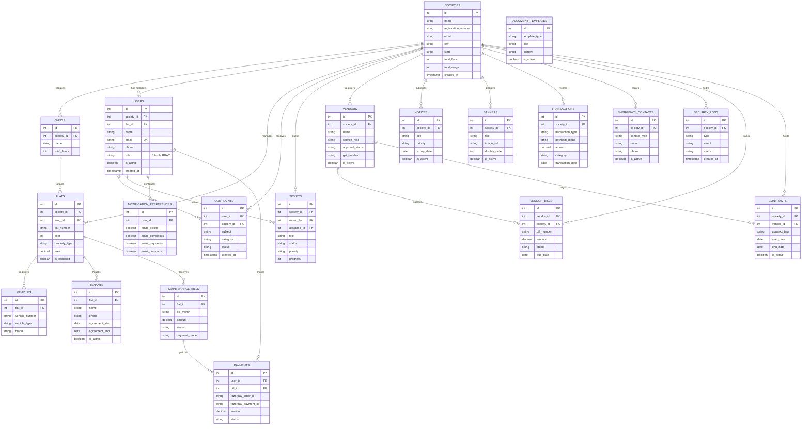
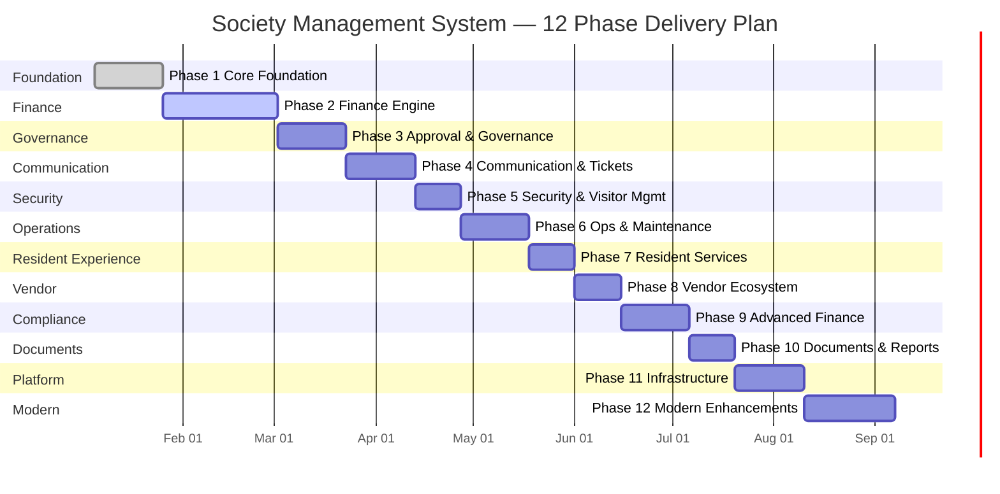
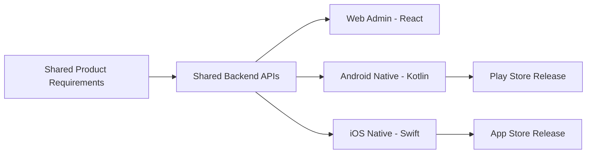
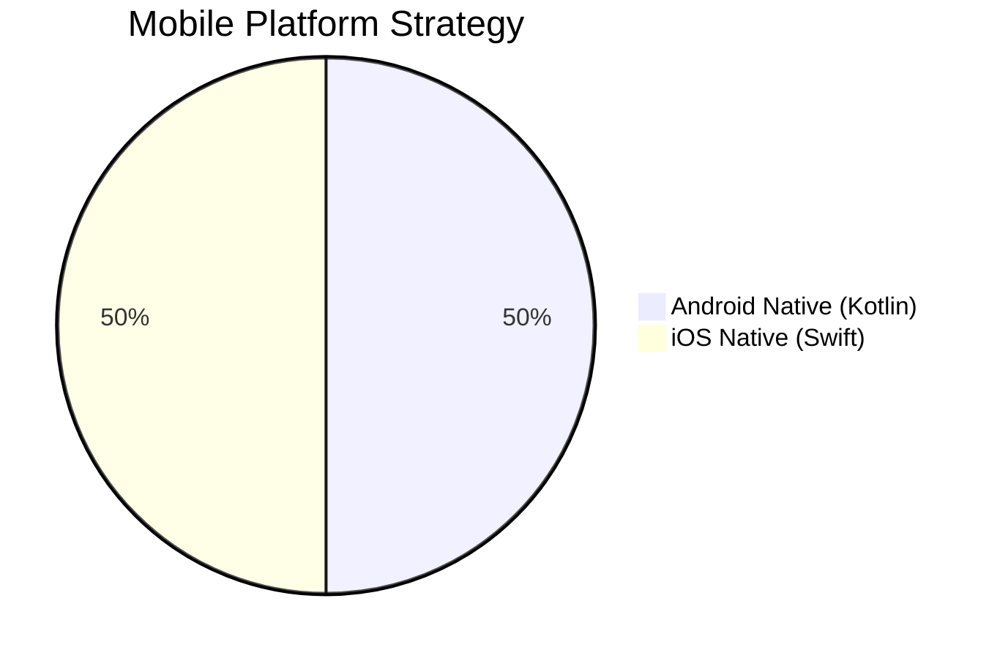

<div align="center">

<!-- ════════════════════════════════════════════════════════════════════════ -->
<!--                           PROJECT HEADER                               -->
<!-- ════════════════════════════════════════════════════════════════════════ -->

# 🏘️ Society Management System

### *A Complete Multi-Tenant Housing Society Administration Platform*

<br/>

<!-- ─────────────────── TECHNOLOGY BADGES ─────────────────── -->


<br/>

<!-- ─────────────────── STATUS BADGES ─────────────────── -->


---

*Built with ❤️ for modern housing societies — managing residents, finances, vendors, complaints, tickets, and more from a single platform.*

</div>

<br/>

<!-- ════════════════════════════════════════════════════════════════════════ -->
<!--                          TABLE OF CONTENTS                             -->
<!-- ════════════════════════════════════════════════════════════════════════ -->

## 📋 Table of Contents

<details open>
<summary><b>Click to expand / collapse</b></summary>

| # | Section | Description |
|---|---------|-------------|
| 1 | [🔭 System Overview](#-system-overview) | High-level architecture and capabilities |
| 2 | [🛠️ Tech Stack](#️-tech-stack) | Complete technology breakdown per layer |
| 3 | [🏗️ Architecture Diagram](#️-architecture-diagram) | ASCII system architecture |
| 4 | [👥 Role Hierarchy & RBAC](#-role-hierarchy--rbac) | 12-role hierarchy with permissions |
| 5 | [🔐 Permission Matrix](#-permission-matrix) | Fine-grained CRUD access per role |
| 6 | [📜 Access Control Rules](#-access-control-rules) | Security enforcement rules |
| 7 | [🖥️ Frontend — Admin Web Panel](#️-frontend--admin-web-panel) | React SPA structure and details |
| 8 | [📱 Mobile Apps — Native (Android + iOS)](#-mobile-apps--native-android--ios) | Dedicated native apps (Kotlin & Swift) |
| 9 | [⚙️ Backend — Spring Boot API](#️-backend--spring-boot-api) | Java backend architecture |
| 10 | [🗄️ Database Design](#️-database-design) | PostgreSQL schema and ER diagram |
| 11 | [🌐 API Reference](#-api-reference) | Complete endpoint documentation |
| 12 | [📦 Response Formats](#-response-formats) | JSON response structure examples |
| 13 | [✨ Features & Capabilities](#-features--capabilities) | Detailed feature breakdown |
| 14 | [🧭 Blueprint Roadmap (Merged)](#-blueprint-roadmap-merged) | 77-feature implementation roadmap |
| 15 | [📱 Native Apps Roadmap (Android + iOS)](#-native-apps-roadmap-android--ios) | Dedicated Android & iOS native app plan |
| 16 | [🚀 Getting Started](#-getting-started) | Setup & installation guide |
| 17 | [🌍 Environment Variables](#-environment-variables) | Configuration reference |
| 18 | [☁️ Deployment](#️-deployment) | Render cloud deployment |
| 19 | [📂 Project Structure Overview](#-project-structure-overview) | Complete monorepo file tree |
| 20 | [🤝 Contributing](#-contributing) | Contribution guidelines |
| 21 | [📄 License](#-license) | MIT License |

</details>

<br/>

---

<!-- ════════════════════════════════════════════════════════════════════════ -->
<!--                         1. SYSTEM OVERVIEW                             -->
<!-- ════════════════════════════════════════════════════════════════════════ -->

## 🔭 System Overview

<div align="center">

| Category | Details |
|:--------:|---------|
| 🏢 **Purpose** | End-to-end management platform for residential housing societies |
| 🌐 **Admin Web** | React 19 SPA with Vite — dashboards, finance, RBAC, bulk operations |
| 📱 **Mobile Apps** | Native Android (Kotlin) + iOS (Swift) — dedicated resident apps |
| ⚙️ **Backend** | Spring Boot 3.5 REST API — JWT auth, RBAC, email, Razorpay |
| 🗄️ **Database** | PostgreSQL 16 with 20+ relational tables |
| 👥 **Roles** | 12-role RBAC hierarchy from Master Admin → Visitor |
| 💳 **Payments** | Razorpay payment gateway integration (INR) |
| 📧 **Notifications** | Email via Gmail SMTP + Firebase push notifications |
| 📊 **Analytics** | Financial reports, MTD/YTD, category breakdowns, Excel exports |
| 🔄 **Bulk Ops** | Excel import/export for users, flats, wings, vendors, tenants, vehicles |
| 🚀 **Deployment** | Render Blueprint — backend + static frontend + managed PostgreSQL |
| 🏗️ **Architecture** | Monorepo with API-first design, shared API layer |

</div>

<br/>

---

<!-- ════════════════════════════════════════════════════════════════════════ -->
<!--                          2. TECH STACK                                 -->
<!-- ════════════════════════════════════════════════════════════════════════ -->

## 🛠️ Tech Stack

### 🖥️ Frontend — Admin Web Panel

| Technology | Version | Purpose |
|:----------:|:-------:|---------|
|  | `19.2.0` | UI component library |
|  | `7.2.4` | Lightning-fast build tool & dev server |
|  | `7.13.0` | Client-side routing with lazy loading |
|  | `5.90.20` | Server state management & caching |
|  | `1.13.3` | HTTP client with interceptors |
|  | `3.7.0` | Dashboard charts and graphs |
|  | `0.563.0` | Icon library (500+ icons) |
|  | `0.18.5` | Excel file parsing for bulk imports |
|  | `2.1.1` | Conditional className utility |

### 📱 Mobile Apps (Native)

| Technology | Platform | Purpose |
|:----------:|:--------:|---------|
|  | Android | Native Android app (Jetpack Compose) |
|  | iOS | Native iOS app (SwiftUI) |
|  | Both | Push notifications via FCM |
|  | Android | HTTP client for REST APIs |
|  | iOS | Networking layer |
|  | Both | Secure token storage |

### ⚙️ Backend

| Technology | Version | Purpose |
|:----------:|:-------:|---------|
|  | `21` | Language runtime (LTS) |
|  | `3.5.10` | Application framework |
|  | `6.x` | Authentication & authorization |
|  | `3.5.x` | ORM & repository pattern |
|  | `42.x` | JDBC database driver |
|  | `0.12.5` | JWT token creation & validation |
|  | `5.2.5` | Excel export generation |
|  | `11.20.3` | Database migration management |
|  | `1.4.6` | Payment gateway SDK |
|  | `1.18.32` | Boilerplate code reduction |
|  | `3.5.x` | SMTP email service |
|  | `3.5.x` | Health checks & monitoring |

### 🗄️ Database & Deployment

| Technology | Version | Purpose |
|:----------:|:-------:|---------|
|  | `16` | Primary relational database |
|  | `Blueprint` | Cloud hosting (backend + frontend + DB) |
|  | `3.9.x` | Java dependency management & build |
|  | `10.x` | JavaScript package management |

<br/>

---

<!-- ════════════════════════════════════════════════════════════════════════ -->
<!--                     3. ARCHITECTURE DIAGRAM                            -->
<!-- ════════════════════════════════════════════════════════════════════════ -->

## 🏗️ Architecture Diagram

```
╔══════════════════════════════════════════════════════════════════════════════════╗
║                        SOCIETY MANAGEMENT SYSTEM                                ║
║                         System Architecture v2.0                                ║
╚══════════════════════════════════════════════════════════════════════════════════╝

  ┌─────────────────────────┐     ┌──────────────────────┐     ┌──────────────────────┐
  │    🖥️ ADMIN WEB PANEL   │     │  📱 ANDROID APP      │     │  📱 iOS APP           │
  │                         │     │                      │     │                      │
  │  React 19 + Vite 7      │     │  Kotlin              │     │  Swift / SwiftUI      │
  │  React Router 7          │     │  Jetpack Compose     │     │  UIKit + SwiftUI     │
  │  TanStack Query 5        │     │  Retrofit + OkHttp   │     │  URLSession          │
  │  Recharts + Lucide       │     │  Firebase FCM        │     │  Firebase FCM        │
  │  XLSX (Bulk Import)      │     │  Android Keystore    │     │  iOS Keychain        │
  │                         │     │                      │     │                      │
  │  Port: 5173 (dev)       │     │  Play Store          │     │  App Store           │
  └───────────┬─────────────┘     └──────────┬───────────┘     └──────────┬───────────┘
              │                               │                           │
              │              HTTPS / REST JSON │                           │
              └───────────────┬───────────────┘───────────────────────────┘
                              │
                     ┌───────▼───────┐
                     │  📡 API LAYER │
                     │               │
                     │  Shared Axios │
                     │  Instance     │
                     │  JWT Bearer   │
                     │  Interceptors │
                     └───────┬───────┘
                             │
              ╔══════════════▼══════════════════════════════════════╗
              ║              ⚙️ SPRING BOOT BACKEND                 ║
              ║                                                    ║
              ║  ┌─────────────┐  ┌──────────────┐  ┌───────────┐ ║
              ║  │ 🔐 Security │  │ 🎯 Controllers│  │ 📧 Email  │ ║
              ║  │             │  │              │  │           │ ║
              ║  │ JWT Filter  │  │ 20+ REST     │  │ Gmail     │ ║
              ║  │ RBAC Check  │  │ Controllers  │  │ SMTP      │ ║
              ║  │ CORS Config │  │ CRUD + Bulk  │  │ Templates │ ║
              ║  └──────┬──────┘  └──────┬───────┘  └───────────┘ ║
              ║         │                │                         ║
              ║  ┌──────▼────────────────▼───────┐                 ║
              ║  │      📋 SERVICE LAYER          │                 ║
              ║  │                               │                 ║
              ║  │  Business Logic + Validation  │                 ║
              ║  │  Role Permission Checks       │                 ║
              ║  │  Bulk Import Processing       │                 ║
              ║  │  Payment Processing           │                 ║
              ║  │  Report Generation            │                 ║
              ║  └──────────────┬────────────────┘                 ║
              ║                 │                                   ║
              ║  ┌──────────────▼────────────────┐                 ║
              ║  │    🗃️ REPOSITORY LAYER         │                 ║
              ║  │                               │                 ║
              ║  │  Spring Data JPA Repositories │                 ║
              ║  │  Custom Queries               │                 ║
              ║  │  Hibernate ORM                │                 ║
              ║  └──────────────┬────────────────┘                 ║
              ║                 │                                   ║
              ╚═════════════════╪═══════════════════════════════════╝
                                │
                     ┌──────────▼──────────┐
                     │  🗄️ POSTGRESQL 18    │
                     │                     │
                     │  60+ Tables         │
                     │  Foreign Keys       │
                     │  CHECK Constraints  │
                     │  Indexes            │
                     │                     │
                     │  Render Managed DB  │
                     └─────────────────────┘

  ┌──────────────────────────────────────────────────────────────────┐
  │  🔗 EXTERNAL SERVICES                                           │
  │                                                                  │
  │  💳 Razorpay  ──── Payment Gateway (INR)                        │
  │  📧 Gmail SMTP ─── Transactional Emails (Password Reset, etc.) │
  │  ☁️ Render     ──── Cloud Hosting + Managed PostgreSQL          │
  └──────────────────────────────────────────────────────────────────┘
```

<br/>

---

<!-- ════════════════════════════════════════════════════════════════════════ -->
<!--                    4. ROLE HIERARCHY & RBAC                            -->
<!-- ════════════════════════════════════════════════════════════════════════ -->

## 👥 Role Hierarchy & RBAC

The system implements a **12-role Role-Based Access Control** hierarchy. Each role has strictly defined permissions for user management and data access. Legacy `PLATFORM_OWNER` and `ORGANIZATION_OWNER` roles have been removed — `MASTER_ADMIN` is the sole top-level role.

```
╔═══════════════════════════════════════════════════════════════════════════════╗
║                           ROLE HIERARCHY TREE                                ║
║                      (12-Role Access Control System)                         ║
╚═══════════════════════════════════════════════════════════════════════════════╝

                    ╔══════════════════════╗
                    ║    MASTER_ADMIN      ║  Level 0 — Platform Super Admin
                    ║   👑 Full Access     ║  Manages ALL organizations & societies
                    ╚══════════╤═══════════╝
                               │
                    ╔══════════▼═══════════╗
                    ║   SOCIETY_ADMIN      ║  Level 1 — Single Society Super Admin
                    ║   🔧 Full Control    ║  FULL CRUD on ALL roles below
                    ╚══════════╤═══════════╝
                               │
              ┌────────────────┼────────────────┐
              │                │                 │
   ╔══════════▼═══════════╗ ╔═▼════════════╗ ╔══▼═════════════════╗
   ║     CHAIRMAN         ║ ║  SECRETARY   ║ ║     TREASURER      ║
   ║   🎖️ Presides        ║ ║  📝 Admin    ║ ║   💰 Finance Head  ║
   ╚══════════╤═══════════╝ ╚══╤═══════════╝ ╚══════╤═════════════╝
              └────────────────┼──────────────────────┘
                               │  Level 2 — Governing Body (shared CRUD)
                               │
              ┌────────────────┼────────────────┐
              │                                 │
   ╔══════════▼═══════════╗          ╔══════════▼═══════════╗
   ║     COMMITTEE        ║          ║      MANAGER         ║
   ║   📋 Committee Mbr   ║          ║   🔨 Operations      ║
   ╚══════════╤═══════════╝          ╚═══════════════════════╝
              │                                          Level 3
              │
   ┌──────────┼──────────┐
   │                     │
╔══▼═══════════════╗  ╔══▼═══════════════╗
║    EMPLOYEE      ║  ║     MEMBER       ║
║  👷 Staff        ║  ║  🏠 Flat Owner   ║  Level 4
╚══════════════════╝  ╚══════════════════╝
                               │
              ┌────────────────┼────────────────┐
              │                                 │
   ╔══════════▼═══════════╗          ╔══════════▼═══════════╗
   ║      TENANT          ║          ║      VENDOR          ║
   ║   🔑 Renter          ║          ║   🏪 Service Provider║
   ╚══════════════════════╝          ╚══════════════════════╝
                                                         Level 5
                    ╔══════════════════════╗
                    ║      VISITOR         ║
                    ║   🚶 Guest           ║  Level 6
                    ╚══════════════════════╝
```

> **12 roles total.** Legacy `PLATFORM_OWNER` and `ORGANIZATION_OWNER` have been removed. `MASTER_ADMIN` is the sole top role. `VENDOR` was added as a new login-capable role.

### 🏷️ Role Descriptions

| Level | Role | Description | Key Responsibilities |
|:-----:|:----:|:------------|:--------------------|
| 0 | `MASTER_ADMIN` | 👑 Platform Super Admin | Manages ALL organizations, societies, and users platform-wide |
| 1 | `SOCIETY_ADMIN` | 🔧 Society Super Admin | Full control over single society, ALL CRUD on roles below |
| 2 | `CHAIRMAN` | 🎖️ Governing Body Head | Presides meetings, final approval authority, bank signatory |
| 2 | `SECRETARY` | 📝 Administrative Head | Documentation, records, day-to-day operations |
| 2 | `TREASURER` | 💰 Financial Head | Finances, billing, payments, accounts management |
| 3 | `COMMITTEE` | 📋 Committee Member | View all + limited write (tickets, notices — NO finance writes) |
| 3 | `MANAGER` | 🔨 Operations Manager | Operational management (NO user CRUD rights) |
| 4 | `EMPLOYEE` | 👷 Staff / Security | Handles visitors, gate logs, basic operational tasks |
| 4 | `MEMBER` | 🏠 Flat Owner | Views own data, raises tickets & complaints |
| 5 | `TENANT` | 🔑 Renter | Limited access — own profile, raise tickets |
| 5 | `VENDOR` | 🏪 External Vendor | Own bills, invoices, work status |
| 6 | `VISITOR` | 🚶 Guest | Minimal access — own profile only |

<br/>

---

<!-- ════════════════════════════════════════════════════════════════════════ -->
<!--                      5. PERMISSION MATRIX                              -->
<!-- ════════════════════════════════════════════════════════════════════════ -->

## 🔐 Permission Matrix

### User Management CRUD Permissions

> Each role can only **create**, **update/delete**, and **read** the roles specified below. `MASTER_ADMIN` has full CRUD on everything. `SOCIETY_ADMIN` has full CRUD on all roles below Level 1.

| Role | Can CREATE | Can UPDATE / DELETE | Can READ |
|:-----|:-----------|:--------------------|:---------|
| `MASTER_ADMIN` | **ALL roles** (11 roles) | **ALL roles** (11 roles) | **ALL roles** |
| `SOCIETY_ADMIN` | CHAIRMAN → VISITOR + VENDOR (10 roles) | CHAIRMAN → VISITOR + VENDOR (10 roles) | ALL in society |
| `CHAIRMAN` | COMMITTEE, MANAGER, EMPLOYEE, MEMBER, TENANT, VISITOR | Same | All below |
| `SECRETARY` | COMMITTEE, MANAGER, EMPLOYEE, MEMBER, TENANT, VISITOR | Same | All below |
| `TREASURER` | COMMITTEE, MANAGER, EMPLOYEE, MEMBER, TENANT, VISITOR | Same | All below |
| `COMMITTEE` | EMPLOYEE, MEMBER | EMPLOYEE, MEMBER | EMPLOYEE, MEMBER + below |
| `EMPLOYEE` | VISITOR | VISITOR | VISITOR |
| `MEMBER` | TENANT | TENANT | TENANT |
| `MANAGER` | ❌ None | ❌ None | Operations scope |
| `VENDOR` | ❌ None | ❌ None | Own data only |
| `TENANT` | ❌ None | ❌ None | Own profile only |
| `VISITOR` | ❌ None | ❌ None | Own profile only |

### Module Access Matrix

| Module | MASTER_ADMIN | SOCIETY_ADMIN | CHAIRMAN | SECRETARY | TREASURER | COMMITTEE | MANAGER | EMPLOYEE | MEMBER | VENDOR | TENANT | VISITOR |
|:-------|:-:|:-:|:-:|:-:|:-:|:-:|:-:|:-:|:-:|:-:|:-:|:-:|
| Organizations | ✅ CRUD | ❌ | ❌ | ❌ | ❌ | ❌ | ❌ | ❌ | ❌ | ❌ | ❌ | ❌ |
| Societies | ✅ CRUD | ✅ Read | ❌ | ❌ | ❌ | ❌ | ❌ | ❌ | ❌ | ❌ | ❌ | ❌ |
| Users | ✅ CRUD | ✅ CRUD | ✅ CRUD | ✅ CRUD | ✅ CRUD | ✅ CRUD | ❌ | ✅ Limited | ✅ Limited | ❌ | ❌ | ❌ |
| Flats / Wings | ✅ | ✅ CRUD | ✅ CRUD | ✅ CRUD | ✅ CRUD | ✅ Read | ✅ CRUD | ✅ Read | ✅ Own | ❌ | ✅ Own | ❌ |
| Finance | ✅ | ✅ CRUD | ✅ CRUD | ✅ CRUD | ✅ CRUD | ✅ Read | ❌ | ❌ | ✅ Own Bills | ❌ | ✅ Own | ❌ |
| Vendors | ✅ | ✅ CRUD | ✅ CRUD | ✅ CRUD | ✅ CRUD | ✅ Read | ✅ CRUD | ❌ | ❌ | ✅ Own | ❌ | ❌ |
| Complaints | ✅ | ✅ CRUD | ✅ CRUD | ✅ CRUD | ✅ CRUD | ✅ CRUD | ✅ Read | ❌ | ✅ Own | ❌ | ✅ Own | ❌ |
| Tickets | ✅ | ✅ CRUD | ✅ CRUD | ✅ CRUD | ✅ CRUD | ✅ CRUD | ✅ CRUD | ✅ Create | ✅ Create | ❌ | ✅ Create | ❌ |
| Notices | ✅ | ✅ CRUD | ✅ CRUD | ✅ CRUD | ✅ CRUD | ✅ Read | ✅ CRUD | ✅ Read | ✅ Read | ❌ | ✅ Read | ✅ Read |
| Reports | ✅ | ✅ Full | ✅ Full | ✅ Full | ✅ Full | ✅ Limited | ❌ | ❌ | ❌ | ❌ | ❌ | ❌ |
| Settings | ✅ | ✅ Full | ✅ Limited | ✅ Limited | ✅ Limited | ❌ | ❌ | ❌ | ❌ | ❌ | ❌ | ❌ |

<br/>

---

<!-- ════════════════════════════════════════════════════════════════════════ -->
<!--                    6. ACCESS CONTROL RULES                             -->
<!-- ════════════════════════════════════════════════════════════════════════ -->

## 📜 Access Control Rules

```
╔══════════════════════════════════════════════════════════════════╗
║                    SECURITY ENFORCEMENT RULES                    ║
╚══════════════════════════════════════════════════════════════════╝
```

| # | Rule | Description |
|:-:|:-----|:------------|
| 1 | **Hierarchical User CRUD** | Each role can only create/manage the roles specified in the permission matrix — no skipping levels |
| 2 | **Read Access Flows Downward** | A parent role can read all descendant roles in the hierarchy |
| 3 | **Update/Delete Scoped by Matrix** | Modification access is limited to the roles each role can manage |
| 4 | **MASTER_ADMIN Full Access** | Master Admin has **full CRUD** on ALL 11 roles below Level 0 |
| 5 | **SOCIETY_ADMIN Exception** | Society Admin has **full CRUD** on ALL 10 roles below Level 1 |
| 6 | **Head Roles Share Level 2** | Chairman, Secretary, and Treasurer are peers — they cannot manage each other, but share CRUD on roles below |
| 7 | **MANAGER Has No User CRUD** | Manager role exists for operations only — no user creation/modification rights |
| 8 | **COMMITTEE No Finance Writes** | Committee members can read financial data but cannot create/modify financial records |
| 9 | **Society Data Isolation** | Data is strictly isolated per society — users can only access their own society's data |
| 10 | **Least-Privilege Enforcement** | Every request is validated against the minimum required permissions |
| 11 | **JWT Token Validation** | Every API call requires a valid JWT token (except auth endpoints) |
| 12 | **Force Delete Protection** | Cascade deletes require explicit `force=true` flag to prevent accidental data loss |
| 13 | **Vendor Approval Workflow** | Vendors require admin approval before being active — PENDING → APPROVED/REJECTED |
| 14 | **Ticket Assignment Control** | Tickets can only be assigned by authorized roles (admin/committee and above) |

<br/>

---

<!-- ════════════════════════════════════════════════════════════════════════ -->
<!--                 7. FRONTEND — ADMIN WEB PANEL                          -->
<!-- ════════════════════════════════════════════════════════════════════════ -->

## 🖥️ Frontend — Admin Web Panel

### 📁 Directory Structure

```
📁 admin-web/
├── 📄 index.html                          # SPA entry point
├── 📄 package.json                        # Dependencies & scripts
├── 📄 vite.config.js                      # Vite build configuration
├── 📄 eslint.config.js                    # Linting rules
├── 📁 public/                             # Static assets
└── 📁 src/
    ├── 📄 App.jsx                         # Root component — routes, layout, auth
    ├── 📄 App.css                         # Global app styles
    ├── 📄 main.jsx                        # React DOM entry point
    │
    ├── 📁 assets/
    │   └── 📁 icons/                      # SVG icon assets
    │
    ├── 📁 components/                     # Shared UI components
    │   ├── 📄 index.js                    # Barrel export
    │   ├── 📄 Layout.jsx                  # Main layout (sidebar + header + content)
    │   ├── 📄 AsyncButton.jsx             # Loading-state button wrapper
    │   ├── 📄 BulkImportModal.jsx         # Excel import modal with validation
    │   ├── 📄 FormComponents.jsx          # Reusable input, select, textarea
    │   ├── 📄 PageShell.jsx               # Page wrapper with title & breadcrumbs
    │   ├── 📄 PermissionDenied.jsx        # 403 access denied screen
    │   ├── 📄 SkeletonLoaders.jsx         # Loading skeleton placeholders
    │   └── 📄 Toggle.jsx                  # Toggle switch component
    │
    ├── 📁 context/                        # React context providers
    │   ├── 📄 index.js                    # Barrel export
    │   ├── 📄 AuthContext.jsx             # JWT auth state + login/logout/register
    │   ├── 📄 SettingsContext.jsx          # App settings & preferences
    │   ├── 📄 ThemeContext.jsx            # Dark/light theme toggle
    │   ├── 📄 ToastContext.jsx            # Toast notification system
    │   └── 📄 ConfirmDialogContext.jsx    # Confirmation modal system
    │
    ├── 📁 hooks/                          # Custom React hooks
    │   ├── 📄 useBackendStatus.js         # Backend health check hook
    │   ├── 📄 useMinLoadingTime.js        # Minimum loading duration hook
    │   └── 📄 useRazorpay.js             # Razorpay checkout integration hook
    │
    ├── 📁 pages/                          # Page components (lazy-loaded)
    │   ├── 📁 auth/                       # Authentication pages
    │   │   ├── 📄 Welcome.jsx             # Landing / hero page
    │   │   ├── 📄 Login.jsx               # Login form with remember me
    │   │   ├── 📄 ForgotPassword.jsx      # Password reset request
    │   │   └── 📄 ResetPassword.jsx       # Token-based password reset
    │   │
    │   ├── 📁 core/                       # Core application pages
    │   │   ├── 📄 Dashboard.jsx           # Role-based dashboard with statistics
    │   │   ├── 📄 Settings.jsx            # App settings & notification prefs
    │   │   └── 📄 Reports.jsx             # Financial reports & analytics
    │   │
    │   ├── 📁 users/                      # User management
    │   │   ├── 📄 Users.jsx               # User list + CRUD + bulk import
    │   │   └── 📄 RolesPermissions.jsx    # Role management & permission view
    │   │
    │   ├── 📁 society/                    # Organization & society management
    │   │   ├── 📄 Organizations.jsx       # Organization list + CRUD
    │   │   ├── 📄 OrganizationDetail.jsx  # Single org detail view
    │   │   ├── 📄 Societies.jsx           # Society list + CRUD
    │   │   ├── 📄 SocietyDetail.jsx       # Single society detail view
    │   │   └── 📄 SocietyAdmins.jsx       # Society admin management
    │   │
    │   ├── 📁 unit/                       # Property unit management
    │   │   ├── 📄 UnitManagement.jsx      # Flat management + bulk import
    │   │   ├── 📄 Wings.jsx               # Wing/building management
    │   │   ├── 📄 Tenants.jsx             # Tenant records + bulk import
    │   │   └── 📄 Vehicles.jsx            # Vehicle registration + bulk import
    │   │
    │   ├── 📁 finance/                    # Financial management
    │   │   ├── 📄 VendorBills.jsx         # Vendor bill tracking & payment
    │   │   ├── 📄 Contracts.jsx           # Vendor contracts management
    │   │   ├── 📄 MaintenanceBills.jsx    # Maintenance bill generation
    │   │   ├── 📄 Transactions.jsx        # Income/expense tracking
    │   │   ├── 📄 Payments.jsx            # Razorpay payment processing
    │   │   └── 📄 MyBills.jsx             # Member's own bill view
    │   │
    │   ├── 📁 communication/             # Communication & support
    │   │   ├── 📄 Notices.jsx             # Society notice board
    │   │   ├── 📄 Banners.jsx             # Banner management
    │   │   ├── 📄 Tickets.jsx             # Support ticket system
    │   │   ├── 📄 Complaints.jsx          # Complaint management
    │   │   ├── 📄 EmergencyContacts.jsx   # Emergency contact directory
    │   │   └── 📄 Documents.jsx           # Document template generator
    │   │
    │   ├── 📁 vendors/                    # Vendor management
    │   │   └── 📄 Vendors.jsx             # Vendor directory + approval workflow
    │   │
    │   └── 📁 footer/                     # Public footer pages
    │       ├── 📄 About.jsx               # About page
    │       ├── 📄 Privacy.jsx             # Privacy policy
    │       ├── 📄 Terms.jsx               # Terms of service
    │       ├── 📄 Contact.jsx             # Contact form
    │       ├── 📄 Pricing.jsx             # Pricing plans
    │       ├── 📄 Blog.jsx                # Blog page
    │       ├── 📄 Demo.jsx                # Demo request
    │       └── 📄 Help.jsx                # Help / FAQ
    │
    ├── 📁 styles/                         # CSS architecture
    │   ├── 📄 index.css                   # Style entry point
    │   ├── 📄 main.css                    # Main layout styles
    │   ├── 📄 animations.css              # CSS animations & transitions
    │   ├── 📁 base/                       # Reset, typography, variables
    │   ├── 📁 components/                 # Component-specific styles
    │   ├── 📁 pages/                      # Page-specific styles
    │   └── 📁 utils/                      # Utility classes
    │
    └── 📁 utils/                          # Utility functions
        ├── 📄 index.js                    # General utilities
        ├── 📄 validation.js               # Form validation helpers
        └── 📄 deviceDetect.js             # Device detection utility
```

### 📄 Page Components & Routes

| # | Page Component | Route | Features |
|:-:|:--------------|:------|:---------|
| 1 | `Welcome` | `/` | Hero landing page with call-to-action |
| 2 | `Login` | `/login` | Email/password auth with "Remember Me" |
| 3 | `ForgotPassword` | `/forgot-password` | Email-based password reset request |
| 4 | `ResetPassword` | `/reset-password` | Token-based password reset form |
| 5 | `Dashboard` | `/dashboard` | Role-based stats, charts, quick actions |
| 6 | `Users` | `/users` | User table with CRUD, bulk import/export |
| 7 | `RolesPermissions` | `/roles-permissions` | Role hierarchy viewer & permission info |
| 8 | `Organizations` | `/organizations` | Organization management table |
| 9 | `OrganizationDetail` | `/organization/:id` | Single org detail with societies list |
| 10 | `Societies` | `/societies` | Society list with search & filters |
| 11 | `SocietyDetail` | `/society/:id` | Society dashboard, stats, members |
| 12 | `SocietyAdmins` | `/society-admins` | Admin assignment per society |
| 13 | `UnitManagement` | `/unit-management` | Flat CRUD + bulk import + wing assign |
| 14 | `Wings` | `/wings` | Building wing management + bulk import |
| 15 | `Tenants` | `/tenants` | Tenant registry + lease tracking |
| 16 | `Vehicles` | `/vehicles` | Vehicle registration + parking |
| 17 | `Vendors` | `/vendors` | Vendor directory + approval workflow |
| 18 | `VendorBills` | `/vendor-bills` | Bill tracking + payment recording |
| 19 | `Contracts` | `/contracts` | Contract lifecycle management |
| 20 | `MaintenanceBills` | `/maintenance-bills` | Bill generation + payment tracking |
| 21 | `Transactions` | `/transactions` | Income/expense ledger |
| 22 | `Payments` | `/payments` | Razorpay online payment processing |
| 23 | `MyBills` | `/my-bills` | Member's personal bill view |
| 24 | `Reports` | `/reports` | MTD, YTD, custom range financial reports |
| 25 | `Notices` | `/notices` | Society notice board (CRUD) |
| 26 | `Banners` | `/banners` | Image banner management |
| 27 | `Tickets` | `/tickets` | Support tickets with status workflow |
| 28 | `Complaints` | `/complaints` | Complaint filing & resolution |
| 29 | `EmergencyContacts` | `/emergency-contacts` | Emergency contact directory |
| 30 | `Documents` | `/documents` | Document template generator |
| 31 | `Settings` | `/settings` | App preferences & notification settings |
| 32 | `About` | `/about` | About page |
| 33 | `Privacy` | `/privacy` | Privacy policy |
| 34 | `Terms` | `/terms` | Terms of service |
| 35 | `Contact` | `/contact` | Contact form |
| 36 | `Pricing` | `/pricing` | Pricing information |

### 🧩 Shared Component Library

| Component | File | Description |
|:----------|:-----|:------------|
| `Layout` | `Layout.jsx` | Application shell — responsive sidebar navigation, header with user menu, content area with scroll management |
| `AsyncButton` | `AsyncButton.jsx` | Button with automatic loading spinner state during async operations (API calls) |
| `BulkImportModal` | `BulkImportModal.jsx` | Multi-step Excel import flow — file selection → validation preview → import confirmation |
| `FormComponents` | `FormComponents.jsx` | Reusable form primitives — `Input`, `Select`, `TextArea`, `DatePicker` with validation |
| `PageShell` | `PageShell.jsx` | Page wrapper providing consistent title, breadcrumbs, and action button area |
| `PermissionDenied` | `PermissionDenied.jsx` | 403 Forbidden screen shown when user lacks required role permissions |
| `SkeletonLoaders` | `SkeletonLoaders.jsx` | Content placeholder animations — table rows, cards, stat boxes during data loading |
| `Toggle` | `Toggle.jsx` | Animated toggle switch with label support for boolean settings |

### 🪝 Custom Hook Library

| Hook | File | Description |
|:-----|:-----|:------------|
| `useBackendStatus` | `useBackendStatus.js` | Polls `/actuator/health` to detect backend availability, shows warning when offline |
| `useMinLoadingTime` | `useMinLoadingTime.js` | Ensures minimum loading duration to prevent jarring flash of content |
| `useRazorpay` | `useRazorpay.js` | Manages Razorpay checkout flow — script loading, order creation, payment verification |

### 🔌 API Layer Architecture

The frontend uses a **shared centralized API layer** (`api/index.js`) that provides type-safe API modules for every backend resource.

```javascript
// ═══════════════════════════════════════════════════════════════
// Shared Axios Instance — used by admin-web
// ═══════════════════════════════════════════════════════════════

import axios from 'axios'

const api = axios.create({
  baseURL: import.meta.env.VITE_API_URL || 'http://localhost:8080',
  headers: { 'Content-Type': 'application/json' },
  withCredentials: true,
})

// ─── Request Interceptor: Attach JWT token ───
api.interceptors.request.use((config) => {
  const token = localStorage.getItem('token')
  if (token) {
    config.headers.Authorization = `Bearer ${token}`
  }
  return config
})

// ─── Response Interceptor: Handle 401 auto-logout ───
api.interceptors.response.use(
  (response) => response,
  (error) => {
    if (error.response?.status === 401) {
      localStorage.removeItem('token')
      localStorage.removeItem('user')
      window.location.href = '/login'
    }
    return Promise.reject(error)
  }
)
```

### 📡 Available API Modules

| # | API Module | Base Path | Key Operations |
|:-:|:-----------|:----------|:---------------|
| 1 | `authApi` | `/auth` | login, register, logout, forgotPassword, resetPassword, changePassword, getCurrentUser |
| 2 | `societyApi` | `/societies` | CRUD, getByOrg, search, delete(force) |
| 3 | `organizationApi` | `/organizations` | CRUD, getAll, delete(force) |
| 4 | `userApi` | `/users` | CRUD, getByRole, getBySociety, bulkImport, exportUsers, downloadTemplate |
| 5 | `flatApi` | `/flats` | CRUD, getBySociety, bulkImport/validate/template |
| 6 | `wingApi` | `/api/wings` | CRUD, getBySociety, bulkImport/validate/template |
| 7 | `vendorApi` | `/vendors` | CRUD, approve/reject/deactivate, getPending, bulkImport |
| 8 | `vendorBillApi` | `/vendor-bills` | CRUD, getByVendor, getBySociety, recordPayment, getPending |
| 9 | `contractApi` | `/contracts` | CRUD, getByType, getExpiringSoon, deactivate |
| 10 | `maintenanceBillApi` | `/maintenance-bills` | CRUD, generateForSociety, getPreview, recordPayment |
| 11 | `transactionApi` | `/transactions` | CRUD, getByDateRange, getSummary, getSummaryByCategory |
| 12 | `noticeApi` | `/notices` | CRUD, getBySociety, getActive |
| 13 | `bannerApi` | `/banners` | CRUD, getActive, deactivate |
| 14 | `ticketApi` | `/tickets` | CRUD, updateStatus, updateProgress, assign, getOverdue |
| 15 | `complaintApi` | `/complaints` | CRUD, updateStatus, getByUser, getByStatus |
| 16 | `emergencyContactApi` | `/emergency-contacts` | CRUD, getByType, deactivate, bulkImport |
| 17 | `documentTemplateApi` | `/document-templates` | CRUD, generate, getByType, deactivate |
| 18 | `tenantApi` | `/tenants` | CRUD, getByFlat, getActive, deactivate, bulkImport |
| 19 | `vehicleApi` | `/vehicles` | CRUD, getByFlat, bulkImport/validate/template |
| 20 | `securityLogApi` | `/api/security-logs` | getRecent, create |
| 21 | `notificationPreferenceApi` | `/notification-preferences` | getByUserId, update |
| 22 | `paymentApi` | `/api/payments` | createOrder, verifyPayment, handleFailure, getByUser/Society/Bill |
| 23 | `reportApi` | `/api/reports` | getMTD, getYTD, getCustom, getDashboard, getComparison |
| 24 | `exportApi` | `/api/export` | transactions, maintenanceBills, vendorBills, tickets, flats, financialReport |

<br/>

---

<!-- ════════════════════════════════════════════════════════════════════════ -->
<!--                   8. MOBILE APPS — NATIVE (ANDROID + iOS)              -->
<!-- ════════════════════════════════════════════════════════════════════════ -->

## 📱 Mobile Apps — Native (Android + iOS)

> The mobile layer consists of **two dedicated native codebases** — Android (Kotlin) and iOS (Swift). Both consume the same Spring Boot REST API.

### 📱 Platform Overview

| Platform | Language | UI Framework | HTTP Client | Auth Storage | Push | Target |
|:---------|:---------|:-------------|:------------|:-------------|:-----|:-------|
| **Android** | Kotlin | Jetpack Compose | Retrofit + OkHttp | Android Keystore | Firebase FCM | Play Store |
| **iOS** | Swift | SwiftUI | URLSession | iOS Keychain | Firebase FCM | App Store |

### 📁 Planned Directory Structure

```
📁 android-app/                            # 🤖 Android Native (Kotlin)
├── 📄 build.gradle.kts                    # Gradle build config
├── 📁 app/src/main/
│   ├── 📁 java/.../societyapp/
│   │   ├── 📁 ui/                         # Jetpack Compose screens
│   │   │   ├── 📁 auth/                   # Login, OTP verification
│   │   │   ├── 📁 dashboard/              # Role-based dashboards
│   │   │   ├── 📁 bills/                  # Maintenance bills & payments
│   │   │   ├── 📁 complaints/             # Complaint management
│   │   │   ├── 📁 visitors/               # Visitor log
│   │   │   └── 📁 settings/               # App preferences
│   │   ├── 📁 data/                       # Repository + API layer
│   │   │   ├── 📁 api/                    # Retrofit service interfaces
│   │   │   ├── 📁 model/                  # Data classes / DTOs
│   │   │   └── 📁 repository/             # Repository pattern impl
│   │   ├── 📁 di/                         # Hilt dependency injection
│   │   └── 📁 util/                       # Extensions, formatters
│   └── 📁 res/                            # Android resources
│
📁 ios-app/                                # 🍎 iOS Native (Swift)
├── 📄 Package.swift                       # Swift Package Manager
├── 📁 SocietyApp/
│   ├── 📁 Views/                          # SwiftUI views
│   │   ├── 📁 Auth/                       # Login, OTP verification
│   │   ├── 📁 Dashboard/                  # Role-based dashboards
│   │   ├── 📁 Bills/                      # Maintenance bills & payments
│   │   ├── 📁 Complaints/                 # Complaint management
│   │   ├── 📁 Visitors/                   # Visitor log
│   │   └── 📁 Settings/                   # App preferences
│   ├── 📁 Services/                       # API client layer
│   ├── 📁 Models/                         # Codable data models
│   ├── 📁 Repositories/                   # Data access layer
│   └── 📁 Utils/                          # Helpers, extensions
└── 📁 SocietyAppTests/                    # Unit & UI tests
```

### 📱 Core Screens (Both Platforms)

| # | Screen | Features |
|:-:|:-------|:---------|
| 1 | **Login** | Email/password login with JWT token storage |
| 2 | **Admin Dashboard** | Society stats — users, tickets, bills overview |
| 3 | **Member Dashboard** | Pending bills, recent notices, quick actions |
| 4 | **Staff Dashboard** | Assigned tasks, visitor log, daily summary |
| 5 | **Maintenance Bills** | Bill list, payment status, online payment (Razorpay) |
| 6 | **Complaints** | File complaints, track status, view resolution |
| 7 | **Tickets** | Create/view tickets, status filters |
| 8 | **Notices** | Society notice board |
| 9 | **Visitors** | Visitor log, register new visitors |
| 10 | **Vehicles** | Registered vehicle list per flat |
| 11 | **Payments** | Payment history, Razorpay checkout |
| 12 | **Documents** | Access document templates |
| 13 | **Emergency Contacts** | Emergency contact directory |
| 14 | **Notifications** | Push notification inbox |
| 15 | **Profile** | View & edit user profile |
| 16 | **Settings** | App preferences, theme toggle |

<br/>

---

<!-- ════════════════════════════════════════════════════════════════════════ -->
<!--                  9. BACKEND — SPRING BOOT API                          -->
<!-- ════════════════════════════════════════════════════════════════════════ -->

## ⚙️ Backend — Spring Boot API

### 📁 Directory Structure

```
📁 backend/
├── 📄 pom.xml                             # Maven dependencies & build config
├── 📄 mvnw / mvnw.cmd                    # Maven wrapper scripts
├── 📄 ENV_SETUP.md                        # Environment setup guide
└── 📁 src/
    ├── 📁 main/
    │   ├── 📁 java/com/society/backend/
    │   │   │
    │   │   ├── 📄 BackendApplication.java         # @SpringBootApplication entry
    │   │   ├── 📄 PasswordHasher.java             # BCrypt password utility
    │   │   │
    │   │   ├── 📁 config/                        # ⚙️ Configuration Classes
    │   │   │   ├── 📄 CorsConfig.java             # CORS origin whitelist
    │   │   │   ├── 📄 DataInitializer.java        # Seed data on first run
    │   │   │   ├── 📄 DeleteForceCleanupInterceptor.java  # Force-delete interceptor
    │   │   │   ├── 📄 PasswordConfig.java         # BCryptPasswordEncoder bean
    │   │   │   ├── 📄 RazorpayConfig.java         # Razorpay client initialization
    │   │   │   ├── 📄 SchedulerConfig.java        # @EnableScheduling config
    │   │   │   ├── 📄 SchemaMigrationRunner.java  # SQL migration runner
    │   │   │   ├── 📄 SecurityConfig.java         # Spring Security filter chain
    │   │   │   └── 📄 WebMvcConfig.java           # MVC interceptors registration
    │   │   │
    │   │   ├── 📁 security/                      # 🔐 Security Layer
    │   │   │   ├── 📄 CustomUserDetails.java      # UserDetails implementation
    │   │   │   ├── 📄 CustomUserDetailsService.java # UserDetailsService impl
    │   │   │   ├── 📄 JwtAuthenticationEntryPoint.java # 401 handler
    │   │   │   ├── 📄 JwtAuthenticationFilter.java # JWT token filter
    │   │   │   ├── 📄 JwtUtils.java               # Token create/validate/parse
    │   │   │   └── 📄 RolePermissions.java        # 12-role permission matrix (368 lines)
    │   │   │
    │   │   ├── 📁 controller/                    # 🎯 REST Controllers
    │   │   │   ├── 📄 SecurityLogController.java  # Security audit log endpoints
    │   │   │   ├── 📄 WingController.java         # Wing/building management
    │   │   │   ├── 📁 auth/
    │   │   │   │   └── 📄 AuthController.java     # Login, register, password reset
    │   │   │   ├── 📁 banner/
    │   │   │   │   └── 📄 BannerController.java   # Banner CRUD
    │   │   │   ├── 📁 complaint/
    │   │   │   │   └── 📄 ComplaintController.java # Complaint CRUD + status
    │   │   │   ├── 📁 contract/
    │   │   │   │   └── 📄 ContractController.java  # Contract lifecycle
    │   │   │   ├── 📁 document/
    │   │   │   │   └── 📄 DocumentTemplateController.java # Doc templates
    │   │   │   ├── 📁 emergency/
    │   │   │   │   └── 📄 EmergencyContactController.java # Emergency CRUD
    │   │   │   ├── 📁 export/
    │   │   │   │   └── 📄 ExportController.java   # Excel export endpoints
    │   │   │   ├── 📁 flat/
    │   │   │   │   └── 📄 FlatController.java     # Flat CRUD + bulk import
    │   │   │   ├── 📁 health/
    │   │   │   │   ├── 📄 HealthController.java   # Custom health endpoint
    │   │   │   │   └── 📄 EmailTestController.java # Email test endpoint
    │   │   │   ├── 📁 maintenance/
    │   │   │   │   └── 📄 MaintenanceBillController.java # Bill generation
    │   │   │   ├── 📁 notice/
    │   │   │   │   └── 📄 NoticeController.java   # Notice CRUD
    │   │   │   ├── 📁 notification/
    │   │   │   │   └── 📄 NotificationPreferenceController.java
    │   │   │   ├── 📁 organization/
    │   │   │   │   └── 📄 OrganizationController.java # Org CRUD
    │   │   │   ├── 📁 payment/
    │   │   │   │   └── 📄 PaymentController.java  # Razorpay integration
    │   │   │   ├── 📁 report/
    │   │   │   │   └── 📄 ReportController.java   # Financial reports
    │   │   │   ├── 📁 society/
    │   │   │   │   └── 📄 SocietyController.java  # Society CRUD
    │   │   │   ├── 📁 tenant/
    │   │   │   │   └── 📄 TenantController.java   # Tenant CRUD + bulk
    │   │   │   ├── 📁 ticket/
    │   │   │   │   └── 📄 TicketController.java   # Ticket lifecycle
    │   │   │   ├── 📁 transaction/
    │   │   │   │   └── 📄 TransactionController.java # Transaction CRUD
    │   │   │   ├── 📁 user/
    │   │   │   │   └── 📄 UserController.java     # User CRUD + bulk import
    │   │   │   ├── 📁 vehicle/
    │   │   │   │   └── 📄 VehicleController.java  # Vehicle CRUD + bulk
    │   │   │   └── 📁 vendor/
    │   │   │       ├── 📄 VendorController.java   # Vendor CRUD + approval
    │   │   │       └── 📄 VendorBillController.java # Vendor bill tracking
    │   │   │
    │   │   ├── 📁 entity/                        # 🗃️ JPA Entities (21 classes)
    │   │   │   ├── 📄 Banner.java
    │   │   │   ├── 📄 Complaint.java
    │   │   │   ├── 📄 Contract.java
    │   │   │   ├── 📄 DocumentTemplate.java
    │   │   │   ├── 📄 EmergencyContact.java
    │   │   │   ├── 📄 Flat.java
    │   │   │   ├── 📄 MaintenanceBill.java
    │   │   │   ├── 📄 Notice.java
    │   │   │   ├── 📄 NotificationPreference.java
    │   │   │   ├── 📄 Organization.java
    │   │   │   ├── 📄 PasswordResetToken.java
    │   │   │   ├── 📄 Payment.java
    │   │   │   ├── 📄 Role.java                  # Enum — 12 roles
    │   │   │   ├── 📄 SecurityLog.java
    │   │   │   ├── 📄 Society.java
    │   │   │   ├── 📄 Tenant.java
    │   │   │   ├── 📄 Ticket.java
    │   │   │   ├── 📄 Transaction.java
    │   │   │   ├── 📄 User.java
    │   │   │   ├── 📄 Vehicle.java
    │   │   │   ├── 📄 Vendor.java
    │   │   │   ├── 📄 VendorBill.java
    │   │   │   └── 📄 Wing.java
    │   │   │
    │   │   ├── 📁 dto/                           # 📋 Data Transfer Objects
    │   │   │   ├── 📁 auth/                      # LoginRequest, LoginResponse, RegisterRequest,
    │   │   │   │                                  # ForgotPasswordRequest, ResetPasswordRequest,
    │   │   │   │                                  # ChangePasswordRequest
    │   │   │   ├── 📁 banner/                    # BannerRequest, BannerResponse
    │   │   │   ├── 📁 common/                    # ErrorResponse
    │   │   │   ├── 📁 complaint/                 # ComplaintRequest, ComplaintResponse
    │   │   │   ├── 📁 contract/                  # ContractRequest, ContractResponse
    │   │   │   ├── 📁 document/                  # DocumentTemplateRequest, DocumentTemplateResponse
    │   │   │   ├── 📁 emergency/                 # EmergencyContactRequest, Response, BulkImportResponse, ImportRow
    │   │   │   ├── 📁 flat/                      # FlatRequest, FlatResponse, BulkFlatImportResponse, FlatImportRow
    │   │   │   ├── 📁 maintenance/               # MaintenanceBillRequest, MaintenanceBillResponse
    │   │   │   ├── 📁 notice/                    # NoticeRequest, NoticeResponse
    │   │   │   ├── 📁 notification/              # NotificationPreferenceRequest, Response
    │   │   │   ├── 📁 organization/              # OrganizationRequest, OrganizationResponse
    │   │   │   ├── 📁 payment/                   # CreateOrderRequest, CreateOrderResponse, VerifyPaymentRequest, PaymentResponse
    │   │   │   ├── 📁 report/                    # FinancialReportResponse
    │   │   │   ├── 📁 society/                   # SocietyRequest, SocietyResponse
    │   │   │   ├── 📁 tenant/                    # TenantRequest, Response, BulkImportResponse, ImportRow
    │   │   │   ├── 📁 ticket/                    # TicketRequest, TicketResponse
    │   │   │   ├── 📁 transaction/               # TransactionRequest, TransactionResponse
    │   │   │   ├── 📁 user/                      # UserRequest, UserResponse, BulkImportRequest, BulkImportResponse, BulkCreateUsersResponse, UserImportRow
    │   │   │   ├── 📁 vehicle/                   # VehicleRequest, Response, BulkImportResponse, ImportRow
    │   │   │   ├── 📁 vendor/                    # VendorRequest, VendorResponse, VendorBillRequest, VendorBillResponse, BulkImportResponse, ImportRow
    │   │   │   └── 📁 wing/                      # WingRequest, WingResponse, BulkImportResponse, ImportRow
    │   │   │
    │   │   ├── 📁 repository/                    # 🗃️ JPA Repositories
    │   │   │   ├── 📄 NotificationPreferenceRepository.java
    │   │   │   ├── 📄 PasswordResetTokenRepository.java
    │   │   │   ├── 📄 SecurityLogRepository.java
    │   │   │   ├── 📄 WingRepository.java
    │   │   │   ├── 📁 banner/          └── BannerRepository.java
    │   │   │   ├── 📁 complaint/       └── ComplaintRepository.java
    │   │   │   ├── 📁 contract/        └── ContractRepository.java
    │   │   │   ├── 📁 document/        └── DocumentTemplateRepository.java
    │   │   │   ├── 📁 emergency/       └── EmergencyContactRepository.java
    │   │   │   ├── 📁 flat/            └── FlatRepository.java
    │   │   │   ├── 📁 maintenance/     └── MaintenanceBillRepository.java
    │   │   │   ├── 📁 notice/          └── NoticeRepository.java
    │   │   │   ├── 📁 organization/    └── OrganizationRepository.java
    │   │   │   ├── 📁 payment/         └── PaymentRepository.java
    │   │   │   ├── 📁 society/         └── SocietyRepository.java
    │   │   │   ├── 📁 tenant/          └── TenantRepository.java
    │   │   │   ├── 📁 ticket/          └── TicketRepository.java
    │   │   │   ├── 📁 transaction/     └── TransactionRepository.java
    │   │   │   ├── 📁 user/            └── UserRepository.java
    │   │   │   ├── 📁 vehicle/         └── VehicleRepository.java
    │   │   │   └── 📁 vendor/          ├── VendorRepository.java
    │   │   │                           └── VendorBillRepository.java
    │   │   │
    │   │   ├── 📁 service/                       # 📋 Business Logic Layer
    │   │   │   ├── 📄 SecurityLogService.java
    │   │   │   ├── 📁 auth/           ├── AuthService.java (interface)
    │   │   │   │                      └── AuthServiceImpl.java
    │   │   │   ├── 📁 banner/         ├── BannerService.java
    │   │   │   │                      └── BannerServiceImpl.java
    │   │   │   ├── 📁 common/         ├── EmailService.java
    │   │   │   │                      ├── ReferenceCleanupService.java
    │   │   │   │                      └── RoleService.java
    │   │   │   ├── 📁 complaint/      ├── ComplaintService.java
    │   │   │   │                      └── ComplaintServiceImpl.java
    │   │   │   ├── 📁 contract/       ├── ContractService.java
    │   │   │   │                      └── ContractServiceImpl.java
    │   │   │   ├── 📁 document/       ├── DocumentTemplateService.java
    │   │   │   │                      └── DocumentTemplateServiceImpl.java
    │   │   │   ├── 📁 emergency/      ├── EmergencyContactService.java
    │   │   │   │                      ├── EmergencyContactServiceImpl.java
    │   │   │   │                      └── BulkEmergencyContactImportService.java
    │   │   │   ├── 📁 export/         ├── ExcelExportService.java
    │   │   │   │                      └── ExcelExportServiceImpl.java
    │   │   │   ├── 📁 flat/           ├── FlatService.java
    │   │   │   │                      ├── FlatServiceImpl.java
    │   │   │   │                      └── BulkFlatImportService.java
    │   │   │   ├── 📁 maintenance/    ├── MaintenanceBillService.java
    │   │   │   │                      └── MaintenanceBillServiceImpl.java
    │   │   │   ├── 📁 notice/         ├── NoticeService.java
    │   │   │   │                      └── NoticeServiceImpl.java
    │   │   │   ├── 📁 notification/   └── NotificationPreferenceService.java
    │   │   │   ├── 📁 organization/   ├── OrganizationService.java
    │   │   │   │                      └── OrganizationServiceImpl.java
    │   │   │   ├── 📁 payment/        └── PaymentService.java
    │   │   │   ├── 📁 report/         ├── ReportService.java
    │   │   │   │                      └── ReportServiceImpl.java
    │   │   │   ├── 📁 society/        ├── SocietyService.java
    │   │   │   │                      └── SocietyServiceImpl.java
    │   │   │   ├── 📁 tenant/         ├── TenantService.java
    │   │   │   │                      ├── TenantServiceImpl.java
    │   │   │   │                      └── BulkTenantImportService.java
    │   │   │   ├── 📁 ticket/         ├── TicketService.java
    │   │   │   │                      └── TicketServiceImpl.java
    │   │   │   ├── 📁 transaction/    ├── TransactionService.java
    │   │   │   │                      └── TransactionServiceImpl.java
    │   │   │   ├── 📁 user/           ├── UserService.java
    │   │   │   │                      ├── UserServiceImpl.java
    │   │   │   │                      └── BulkUserImportService.java
    │   │   │   ├── 📁 vehicle/        ├── VehicleService.java
    │   │   │   │                      ├── VehicleServiceImpl.java
    │   │   │   │                      └── BulkVehicleImportService.java
    │   │   │   ├── 📁 vendor/         ├── VendorService.java
    │   │   │   │                      ├── VendorServiceImpl.java
    │   │   │   │                      ├── VendorBillService.java
    │   │   │   │                      ├── VendorBillServiceImpl.java
    │   │   │   │                      └── BulkVendorImportService.java
    │   │   │   └── 📁 wing/           ├── WingService.java
    │   │   │                          ├── WingServiceImpl.java
    │   │   │                          └── BulkWingImportService.java
    │   │   │
    │   │   ├── 📁 exception/                     # ⚠️ Exception Handling
    │   │   │   ├── 📄 AccessDeniedException.java  # 403 custom exception
    │   │   │   ├── 📄 ApiException.java           # Generic API error
    │   │   │   ├── 📄 GlobalExceptionHandler.java # @ControllerAdvice handler
    │   │   │   └── 📄 ResourceNotFoundException.java # 404 exception
    │   │   │
    │   │   └── 📁 scheduler/                     # ⏰ Scheduled Tasks
    │   │       └── 📄 ReminderScheduler.java      # Contract/tenant/bill reminders
    │   │
    │   └── 📁 resources/
    │       ├── 📄 application.properties          # App configuration
    │       └── 📁 db/migration/                   # Flyway SQL migrations
    │
    └── 📁 test/
        └── 📁 java/com/society/backend/
            └── 📁 service/user/
                └── 📄 UserServiceImplTest.java    # Unit tests
```

### 🎯 Controller Summary

| # | Controller | Package | Key Endpoints | Methods |
|:-:|:-----------|:--------|:-------------|:--------|
| 1 | `AuthController` | `controller.auth` | `/auth/**` | login, register, logout, forgotPassword, resetPassword, changePassword |
| 2 | `UserController` | `controller.user` | `/users/**` | CRUD, getByRole, getBySociety, bulkImport, exportUsers |
| 3 | `OrganizationController` | `controller.organization` | `/organizations/**` | CRUD with org-level isolation |
| 4 | `SocietyController` | `controller.society` | `/societies/**` | CRUD, getByOrg, search |
| 5 | `FlatController` | `controller.flat` | `/flats/**` | CRUD, getBySociety, bulkImport |
| 6 | `WingController` | `controller` | `/api/wings/**` | CRUD, getBySociety, bulkImport |
| 7 | `VendorController` | `controller.vendor` | `/vendors/**` | CRUD, approve/reject, getPending, bulkImport |
| 8 | `VendorBillController` | `controller.vendor` | `/vendor-bills/**` | CRUD, recordPayment, getByStatus |
| 9 | `ContractController` | `controller.contract` | `/contracts/**` | CRUD, getExpiringSoon, deactivate |
| 10 | `MaintenanceBillController` | `controller.maintenance` | `/maintenance-bills/**` | CRUD, generate, getPreview, recordPayment |
| 11 | `TransactionController` | `controller.transaction` | `/transactions/**` | CRUD, getByDateRange, getSummary |
| 12 | `PaymentController` | `controller.payment` | `/api/payments/**` | createOrder, verify, handleFailure |
| 13 | `NoticeController` | `controller.notice` | `/notices/**` | CRUD, getBySociety |
| 14 | `BannerController` | `controller.banner` | `/banners/**` | CRUD, getActive, deactivate |
| 15 | `TicketController` | `controller.ticket` | `/tickets/**` | CRUD, updateStatus, assign, getOverdue |
| 16 | `ComplaintController` | `controller.complaint` | `/complaints/**` | CRUD, updateStatus, getByUser |
| 17 | `EmergencyContactController` | `controller.emergency` | `/emergency-contacts/**` | CRUD, deactivate, bulkImport |
| 18 | `DocumentTemplateController` | `controller.document` | `/document-templates/**` | CRUD, generate, deactivate |
| 19 | `TenantController` | `controller.tenant` | `/tenants/**` | CRUD, deactivate, bulkImport |
| 20 | `VehicleController` | `controller.vehicle` | `/vehicles/**` | CRUD, bulkImport |
| 21 | `ReportController` | `controller.report` | `/api/reports/**` | getMTD, getYTD, getCustom, getDashboard |
| 22 | `ExportController` | `controller.export` | `/api/export/**` | Excel exports for all modules |
| 23 | `NotificationPreferenceController` | `controller.notification` | `/notification-preferences/**` | get, update |
| 24 | `SecurityLogController` | `controller` | `/api/security-logs/**` | getRecent, create |
| 25 | `HealthController` | `controller.health` | `/api/health` | Custom health check |
| 26 | `EmailTestController` | `controller.health` | `/api/email-test` | Email delivery test |

### 🗃️ Entity Classes

| # | Entity | Table | Key Fields |
|:-:|:-------|:------|:-----------|
| 1 | `Organization` | `organizations` | id, name, email, phone, address, subscriptionPlan, subscriptionExpiry |
| 2 | `Society` | `societies` | id, name, registrationNumber, address, city, state, organizationId |
| 3 | `User` | `users` | id, fullName, email, phone, password, role (12-value enum), organizationId, societyId, flatId |
| 4 | `Flat` | `flats` | id, flatNumber, floor, block, propertyType, area, societyId, wingId |
| 5 | `Wing` | `wings` | id, name, societyId, totalFloors, totalFlats |
| 6 | `Tenant` | `tenants` | id, flatId, tenantName, phone, leaseStart, leaseEnd, rentAmount, isActive |
| 7 | `Vehicle` | `vehicles` | id, flatId, vehicleNumber, vehicleType, ownerName |
| 8 | `Vendor` | `vendors` | id, societyId, name, serviceType, phone, email, gstNumber, approvalStatus, bankDetails |
| 9 | `VendorBill` | `vendor_bills` | id, vendorId, societyId, billNumber, amount, status, dueDate, paymentDate |
| 10 | `Contract` | `contracts` | id, vendorId, societyId, contractType, startDate, endDate, amount, status |
| 11 | `MaintenanceBill` | `maintenance_bills` | id, flatId, billMonth, amount, dueDate, status, paymentMode, receiptNumber |
| 12 | `Transaction` | `transactions` | id, societyId, type (INCOME/EXPENSE), paymentMode, amount, category, transactionDate |
| 13 | `Payment` | `payments` | id, razorpayOrderId, razorpayPaymentId, amount, status, userId, billId |
| 14 | `Complaint` | `complaints` | id, userId, societyId, category, description, status, resolution |
| 15 | `Ticket` | `tickets` | id, societyId, title, description, raisedBy, assignedTo, status, priority, progress |
| 16 | `Notice` | `notices` | id, societyId, title, content, priority, startDate, endDate |
| 17 | `Banner` | `banners` | id, societyId, title, imageUrl, redirectUrl, startDate, endDate, displayOrder |
| 18 | `EmergencyContact` | `emergency_contacts` | id, societyId, contactType, name, phone, alternatePhone, isActive |
| 19 | `DocumentTemplate` | `document_templates` | id, templateType, title, content, isActive |
| 20 | `NotificationPreference` | `notification_preferences` | id, userId, emailTickets, emailComplaints, emailPayments, emailContracts |
| 21 | `SecurityLog` | `security_logs` | id, societyId, type, event, status, createdAt |
| 22 | `PasswordResetToken` | — | id, token, userId, expiryDate |
| 23 | `Role` | — | Enum: MASTER_ADMIN, SOCIETY_ADMIN, CHAIRMAN, SECRETARY, TREASURER, COMMITTEE, MANAGER, EMPLOYEE, MEMBER, TENANT, VENDOR, VISITOR |

### 🔐 Security Architecture

| Class | Purpose |
|:------|:--------|
| `SecurityConfig` | Spring Security filter chain — JWT filter registration, endpoint whitelisting, CORS, CSRF disabled, stateless sessions |
| `JwtAuthenticationFilter` | OncePerRequestFilter — extracts JWT from Authorization header, validates token, sets SecurityContext |
| `JwtUtils` | Token utility — generateToken (24h / 30d remember-me), validateToken, extractUsername, extractExpiration |
| `JwtAuthenticationEntryPoint` | Handles 401 Unauthorized — returns JSON error response |
| `CustomUserDetailsService` | Loads User entity by email for Spring Security authentication |
| `CustomUserDetails` | Wraps User entity into UserDetails with GrantedAuthority based on role |
| `RolePermissions` | **368-line permission matrix** — defines ALLOWED_CREATIONS, ALLOWED_UPDATES, ALLOWED_READS maps per role |

### ⚙️ Configuration Classes

| Class | Purpose |
|:------|:--------|
| `CorsConfig` | CORS allowed origins from `APP_CORS_ALLOWED_ORIGINS` env var + frontend URL |
| `DataInitializer` | Seeds default MASTER_ADMIN user on first application startup |
| `DeleteForceCleanupInterceptor` | Intercept handler — enables cascade/force delete via `?force=true` query param |
| `PasswordConfig` | Exposes `BCryptPasswordEncoder` as Spring bean |
| `RazorpayConfig` | Initializes `RazorpayClient` with key ID and secret from properties |
| `SchedulerConfig` | Enables `@Scheduled` annotation support for reminder tasks |
| `SchemaMigrationRunner` | Runs SQL migration scripts from classpath on startup |
| `WebMvcConfig` | Registers interceptors (e.g., `DeleteForceCleanupInterceptor`) |

### 📋 Service Layer Features

| Service Domain | Interface | Implementation | Bulk Import | Email | Key Features |
|:--------------|:----------|:---------------|:----------:|:-----:|:-------------|
| Auth | `AuthService` | `AuthServiceImpl` | ❌ | ✅ | Login, register, password reset (email), change password |
| User | `UserService` | `UserServiceImpl` | ✅ `BulkUserImportService` | ✅ | CRUD, role-based filtering, bulk Excel import/export |
| Organization | `OrganizationService` | `OrganizationServiceImpl` | ❌ | ❌ | Multi-org management, subscription tracking |
| Society | `SocietyService` | `SocietyServiceImpl` | ❌ | ❌ | Society CRUD, org association |
| Flat | `FlatService` | `FlatServiceImpl` | ✅ `BulkFlatImportService` | ❌ | Flat management, wing assignment |
| Wing | `WingService` | `WingServiceImpl` | ✅ `BulkWingImportService` | ❌ | Building wing management |
| Vendor | `VendorService` | `VendorServiceImpl` | ✅ `BulkVendorImportService` | ❌ | Vendor CRUD, approval workflow |
| Vendor Bill | `VendorBillService` | `VendorBillServiceImpl` | ❌ | ❌ | Bill tracking, payment recording |
| Contract | `ContractService` | `ContractServiceImpl` | ❌ | ❌ | Contract lifecycle, expiry alerts |
| Maintenance | `MaintenanceBillService` | `MaintenanceBillServiceImpl` | ❌ | ❌ | Bulk generation, payment tracking |
| Transaction | `TransactionService` | `TransactionServiceImpl` | ❌ | ❌ | Income/expense ledger, summaries |
| Payment | — | `PaymentService` | ❌ | ❌ | Razorpay order creation & verification |
| Notice | `NoticeService` | `NoticeServiceImpl` | ❌ | ❌ | Notice board management |
| Banner | `BannerService` | `BannerServiceImpl` | ❌ | ❌ | Banner scheduling & display |
| Ticket | `TicketService` | `TicketServiceImpl` | ❌ | ✅ | Ticket lifecycle, assignment, overdue tracking |
| Complaint | `ComplaintService` | `ComplaintServiceImpl` | ❌ | ❌ | Complaint filing & resolution |
| Emergency | `EmergencyContactService` | `EmergencyContactServiceImpl` | ✅ `BulkEmergencyContactImportService` | ❌ | Emergency contact directory |
| Document | `DocumentTemplateService` | `DocumentTemplateServiceImpl` | ❌ | ❌ | Template management & generation |
| Tenant | `TenantService` | `TenantServiceImpl` | ✅ `BulkTenantImportService` | ❌ | Tenant records, lease tracking |
| Vehicle | `VehicleService` | `VehicleServiceImpl` | ✅ `BulkVehicleImportService` | ❌ | Vehicle registration |
| Export | `ExcelExportService` | `ExcelExportServiceImpl` | ❌ | ❌ | Excel exports for all modules (Apache POI) |
| Report | `ReportService` | `ReportServiceImpl` | ❌ | ❌ | Financial reports — MTD, YTD, custom, dashboard |
| Common | — | `EmailService`, `ReferenceCleanupService`, `RoleService` | ❌ | ✅ | Shared services — email, cleanup, role utils |
| Scheduler | — | `ReminderScheduler` | ❌ | ✅ | Automated contract/tenant/bill expiry reminders |

<br/>

---

<!-- ════════════════════════════════════════════════════════════════════════ -->
<!--                      10. DATABASE DESIGN                               -->
<!-- ════════════════════════════════════════════════════════════════════════ -->

## 🗄️ Database Design

### Entity Relationship Diagram



### 📊 Database Tables Overview

| # | Table | Scope | Foreign Keys | Purpose |
|:-:|:------|:------|:-------------|:--------|
| 1 | `societies` | Root entity | — | Housing society management |
| 2 | `users` | Per society | `society_id`, `flat_id` | User accounts with 12-role RBAC |
| 3 | `flats` | Per society | `society_id`, `wing_id` | Residential unit records |
| 4 | `wings` | Per society | `society_id` | Building wing/block management |
| 5 | `tenants` | Per flat | `flat_id` | Tenant lease records |
| 6 | `vehicles` | Per flat | `flat_id` | Vehicle parking registration |
| 7 | `vendors` | Per society | `society_id` | Vendor directory with approval |
| 8 | `vendor_bills` | Per vendor | `vendor_id`, `society_id` | Vendor invoice tracking |
| 9 | `contracts` | Per vendor | `vendor_id`, `society_id` | Service contract lifecycle |
| 10 | `maintenance_bills` | Per flat | `flat_id` | Monthly maintenance billing |
| 11 | `transactions` | Per society | `society_id` | Income/expense ledger |
| 12 | `payments` | Per user/bill | `user_id`, `bill_id` | Razorpay payment records |
| 13 | `complaints` | Per user | `user_id`, `society_id` | Complaint register |
| 14 | `tickets` | Per society | `society_id`, `raised_by`, `assigned_to` | Support ticket system |
| 15 | `notices` | Per society | `society_id` | Notice board content |
| 16 | `banners` | Per society | `society_id` | Display banner management |
| 17 | `emergency_contacts` | Per society | `society_id` | Emergency contact directory |
| 18 | `document_templates` | Global | — | Document template library |
| 19 | `notification_preferences` | Per user | `user_id` (UNIQUE) | Email notification settings |
| 20 | `security_logs` | Per society | `society_id` | Security audit trail |

### 📝 SQL Schema Examples

<details>
<summary><b>�️ Societies Table</b></summary>

```sql
CREATE TABLE societies (
    id SERIAL PRIMARY KEY,
    name VARCHAR(100),
    address TEXT,
    city VARCHAR(100),
    state VARCHAR(100),
    pincode VARCHAR(10),
    registration_number VARCHAR(50),
    email VARCHAR(100),
    telephone VARCHAR(20),
    total_flats INT DEFAULT 0,
    total_shops INT DEFAULT 0,
    total_offices INT DEFAULT 0,
    total_wings INT DEFAULT 0,
    created_at TIMESTAMP DEFAULT CURRENT_TIMESTAMP
);
```
</details>

<details>
<summary><b>👤 Users Table</b></summary>

```sql
CREATE TABLE users (
    id SERIAL PRIMARY KEY,
    name VARCHAR(100),
    email VARCHAR(100) UNIQUE,
    password VARCHAR(255),
    phone VARCHAR(20),
    society_id INT REFERENCES societies(id),
    flat_id INT,
    account_type VARCHAR(30) CHECK (account_type IN ('SOCIETY_ADMIN') OR account_type IS NULL),
    role VARCHAR(50) CHECK (role IN (
        'MASTER_ADMIN','SOCIETY_ADMIN','CHAIRMAN',
        'SECRETARY','TREASURER','COMMITTEE',
        'MANAGER','EMPLOYEE','MEMBER','TENANT','VENDOR','VISITOR'
    )),
    is_active BOOLEAN DEFAULT TRUE,
    created_at TIMESTAMP DEFAULT CURRENT_TIMESTAMP
);
```
</details>

<details>
<summary><b>🏠 Flats Table</b></summary>

```sql
CREATE TABLE flats (
    id SERIAL PRIMARY KEY,
    society_id INT REFERENCES societies(id),
    wing_id INT,
    flat_number VARCHAR(20) NOT NULL,
    floor INT,
    block VARCHAR(50),
    property_type VARCHAR(50) DEFAULT 'RESIDENTIAL',
    area DECIMAL(10,2),
    is_occupied BOOLEAN DEFAULT FALSE,
    owner_name VARCHAR(100),
    owner_phone VARCHAR(20),
    created_at TIMESTAMP DEFAULT CURRENT_TIMESTAMP,
    updated_at TIMESTAMP
);
```
</details>

<details>
<summary><b>🎫 Tickets Table</b></summary>

```sql
CREATE TABLE tickets (
    id SERIAL PRIMARY KEY,
    society_id INT REFERENCES societies(id),
    title VARCHAR(200) NOT NULL,
    description TEXT,
    category VARCHAR(50),
    priority VARCHAR(20) DEFAULT 'MEDIUM',
    status VARCHAR(20) DEFAULT 'OPEN',
    raised_by INT REFERENCES users(id),
    assigned_to INT REFERENCES users(id),
    resolution TEXT,
    progress INT DEFAULT 0,
    due_date DATE,
    created_at TIMESTAMP DEFAULT CURRENT_TIMESTAMP,
    updated_at TIMESTAMP,
    resolved_at TIMESTAMP
);
```
</details>

<details>
<summary><b>🏪 Vendors Table</b></summary>

```sql
CREATE TABLE vendors (
    id SERIAL PRIMARY KEY,
    society_id INT REFERENCES societies(id),
    name VARCHAR(200) NOT NULL,
    service_type VARCHAR(100),
    contact_person VARCHAR(100),
    phone VARCHAR(20),
    email VARCHAR(100),
    address TEXT,
    gst_number VARCHAR(20),
    pan_number VARCHAR(15),
    bank_name VARCHAR(100),
    account_number VARCHAR(30),
    ifsc_code VARCHAR(15),
    approval_status VARCHAR(20) DEFAULT 'PENDING',
    is_active BOOLEAN DEFAULT TRUE,
    created_at TIMESTAMP DEFAULT CURRENT_TIMESTAMP,
    updated_at TIMESTAMP
);
```
</details>

<details>
<summary><b>💰 Maintenance Bills Table</b></summary>

```sql
CREATE TABLE maintenance_bills (
    id SERIAL PRIMARY KEY,
    flat_id INT REFERENCES flats(id),
    bill_month VARCHAR(7),
    amount DECIMAL(12,2),
    due_date DATE,
    payment_date DATE,
    status VARCHAR(20) DEFAULT 'PENDING',
    payment_mode VARCHAR(20),
    receipt_number VARCHAR(50),
    reference_number VARCHAR(50),
    created_at TIMESTAMP DEFAULT CURRENT_TIMESTAMP,
    paid_at TIMESTAMP
);
```
</details>

<details>
<summary><b>💳 Transactions Table</b></summary>

```sql
CREATE TABLE transactions (
    id SERIAL PRIMARY KEY,
    society_id INT REFERENCES societies(id),
    transaction_type VARCHAR(10),          -- INCOME / EXPENSE
    payment_mode VARCHAR(20),              -- CASH / CHEQUE / ONLINE / UPI
    amount DECIMAL(12,2),
    category VARCHAR(50),
    description TEXT,
    transaction_date DATE,
    reference_number VARCHAR(50),
    cheque_number VARCHAR(30),
    bank_name VARCHAR(100),
    cheque_date DATE,
    related_bill_id INT,
    related_bill_type VARCHAR(20),
    created_at TIMESTAMP DEFAULT CURRENT_TIMESTAMP
);
```
</details>

<details>
<summary><b>🔔 Notification Preferences</b></summary>

```sql
CREATE TABLE notification_preferences (
    id SERIAL PRIMARY KEY,
    user_id INT REFERENCES users(id) UNIQUE,
    email_tickets BOOLEAN DEFAULT TRUE,
    email_complaints BOOLEAN DEFAULT TRUE,
    email_payments BOOLEAN DEFAULT TRUE,
    email_contracts BOOLEAN DEFAULT TRUE
);
```
</details>

<details>
<summary><b>🛡️ Security Logs</b></summary>

```sql
CREATE TABLE security_logs (
    id SERIAL PRIMARY KEY,
    society_id INT REFERENCES societies(id),
    type VARCHAR(20) NOT NULL,
    event VARCHAR(255) NOT NULL,
    status VARCHAR(20) NOT NULL,
    created_at TIMESTAMP DEFAULT CURRENT_TIMESTAMP
);
```
</details>

<br/>

---

<!-- ════════════════════════════════════════════════════════════════════════ -->
<!--                       11. API REFERENCE                                -->
<!-- ════════════════════════════════════════════════════════════════════════ -->

## 🌐 API Reference

> **Base URL:** `http://localhost:8080` (dev) or deployed Render URL  
> **Auth:** All endpoints except `/auth/**` require `Authorization: Bearer <JWT>` header

### 🔑 Authentication Endpoints

| Method | Endpoint | Description | Auth |
|:------:|:---------|:------------|:----:|
| `POST` | `/auth/login` | Login with email & password | ❌ |
| `POST` | `/auth/register` | Register new account | ❌ |
| `POST` | `/auth/logout` | Logout (clear token) | ❌ |
| `POST` | `/auth/forgot-password` | Send password reset email | ❌ |
| `POST` | `/auth/reset-password` | Reset password with token | ❌ |
| `POST` | `/auth/change-password` | Change current password | ✅ |
| `GET` | `/auth/me` | Get current authenticated user | ✅ |

### 👤 User Endpoints

| Method | Endpoint | Description | Auth |
|:------:|:---------|:------------|:----:|
| `GET` | `/users` | Get all users (filtered by role) | ✅ |
| `GET` | `/users/{id}` | Get user by ID | ✅ |
| `GET` | `/users/role/{role}` | Get users by role | ✅ |
| `GET` | `/users/society/{societyId}` | Get users by society | ✅ |
| `POST` | `/users` | Create new user | ✅ |
| `PUT` | `/users/{id}` | Update user | ✅ |
| `DELETE` | `/users/{id}` | Delete user (with force option) | ✅ |
| `POST` | `/users/bulk-import/validate` | Validate Excel for bulk import | ✅ |
| `POST` | `/users/bulk-import` | Process bulk user import | ✅ |
| `GET` | `/users/bulk-import/template` | Download import template | ✅ |
| `GET` | `/users/export` | Export users to Excel | ✅ |

### 🏢 Organization Endpoints

| Method | Endpoint | Description | Auth |
|:------:|:---------|:------------|:----:|
| `GET` | `/organizations` | List all organizations | ✅ |
| `GET` | `/organizations/{id}` | Get organization by ID | ✅ |
| `POST` | `/organizations` | Create organization | ✅ |
| `PUT` | `/organizations/{id}` | Update organization | ✅ |
| `DELETE` | `/organizations/{id}` | Delete organization | ✅ |

### 🏘️ Society Endpoints

| Method | Endpoint | Description | Auth |
|:------:|:---------|:------------|:----:|
| `GET` | `/societies` | List all societies | ✅ |
| `GET` | `/societies/{id}` | Get society by ID | ✅ |
| `GET` | `/societies/organization/{orgId}` | Societies by organization | ✅ |
| `POST` | `/societies` | Create society | ✅ |
| `PUT` | `/societies/{id}` | Update society | ✅ |
| `DELETE` | `/societies/{id}` | Delete society | ✅ |

### 🏠 Flat & Wing Endpoints

| Method | Endpoint | Description | Auth |
|:------:|:---------|:------------|:----:|
| `GET` | `/flats?userId={id}` | List flats for user | ✅ |
| `GET` | `/flats/{id}` | Get flat by ID | ✅ |
| `GET` | `/flats/society/{societyId}` | Flats by society | ✅ |
| `POST` | `/flats?userId={id}` | Create flat | ✅ |
| `PUT` | `/flats/{id}?userId={id}` | Update flat | ✅ |
| `DELETE` | `/flats/{id}?userId={id}` | Delete flat | ✅ |
| `POST` | `/flats/bulk-import/validate` | Validate flat bulk import | ✅ |
| `POST` | `/flats/bulk-import` | Process flat bulk import | ✅ |
| `GET` | `/flats/bulk-import/template` | Download flat import template | ✅ |
| `GET` | `/api/wings` | List all wings | ✅ |
| `GET` | `/api/wings/{id}` | Get wing by ID | ✅ |
| `GET` | `/api/wings/society/{societyId}` | Wings by society | ✅ |
| `POST` | `/api/wings` | Create wing | ✅ |
| `PUT` | `/api/wings/{id}` | Update wing | ✅ |
| `DELETE` | `/api/wings/{id}` | Delete wing | ✅ |

### 🏪 Vendor Endpoints

| Method | Endpoint | Description | Auth |
|:------:|:---------|:------------|:----:|
| `GET` | `/vendors` | List all vendors | ✅ |
| `GET` | `/vendors/{id}` | Get vendor by ID | ✅ |
| `GET` | `/vendors/society/{societyId}` | Vendors by society | ✅ |
| `GET` | `/vendors/common` | Get common/shared vendors | ✅ |
| `GET` | `/vendors/service-type/{type}` | Filter by service type | ✅ |
| `GET` | `/vendors/pending` | Get pending approval vendors | ✅ |
| `POST` | `/vendors?userId={id}` | Create vendor | ✅ |
| `PUT` | `/vendors/{id}?userId={id}` | Update vendor | ✅ |
| `DELETE` | `/vendors/{id}?userId={id}` | Delete vendor | ✅ |
| `PATCH` | `/vendors/{id}/approve` | Approve vendor | ✅ |
| `PATCH` | `/vendors/{id}/reject` | Reject vendor | ✅ |
| `PATCH` | `/vendors/{id}/deactivate` | Deactivate vendor | ✅ |

### 💰 Finance Endpoints

| Method | Endpoint | Description | Auth |
|:------:|:---------|:------------|:----:|
| `GET` | `/vendor-bills` | List vendor bills | ✅ |
| `GET` | `/vendor-bills/vendor/{vendorId}` | Bills by vendor | ✅ |
| `GET` | `/vendor-bills/society/{societyId}` | Bills by society | ✅ |
| `GET` | `/vendor-bills/status/{status}` | Bills by status | ✅ |
| `GET` | `/vendor-bills/pending/{societyId}` | Pending bills | ✅ |
| `POST` | `/vendor-bills?userId={id}` | Create vendor bill | ✅ |
| `POST` | `/vendor-bills/{id}/payment` | Record bill payment | ✅ |
| `GET` | `/contracts` | List contracts | ✅ |
| `GET` | `/contracts/society/{societyId}` | Contracts by society | ✅ |
| `GET` | `/contracts/type/{type}` | Contracts by type | ✅ |
| `GET` | `/contracts/expiring/{societyId}` | Expiring contracts | ✅ |
| `POST` | `/contracts?userId={id}` | Create contract | ✅ |
| `PATCH` | `/contracts/{id}/deactivate` | Deactivate contract | ✅ |
| `GET` | `/maintenance-bills` | List maintenance bills | ✅ |
| `GET` | `/maintenance-bills/flat/{flatId}` | Bills by flat | ✅ |
| `GET` | `/maintenance-bills/month/{month}` | Bills by month | ✅ |
| `GET` | `/maintenance-bills/status/{status}` | Bills by status | ✅ |
| `GET` | `/maintenance-bills/pending` | Pending bills | ✅ |
| `POST` | `/maintenance-bills?userId={id}` | Create maintenance bill | ✅ |
| `POST` | `/maintenance-bills/generate` | Bulk generate bills for society | ✅ |
| `GET` | `/maintenance-bills/generate/preview` | Preview generation | ✅ |
| `POST` | `/maintenance-bills/{id}/payment` | Record payment | ✅ |
| `GET` | `/transactions` | List transactions | ✅ |
| `GET` | `/transactions/society/{societyId}` | By society | ✅ |
| `GET` | `/transactions/type/{type}` | By type (INCOME/EXPENSE) | ✅ |
| `GET` | `/transactions/date-range/{societyId}` | By date range | ✅ |
| `GET` | `/transactions/summary/{societyId}` | Financial summary | ✅ |
| `GET` | `/transactions/summary/{societyId}/by-category` | Category breakdown | ✅ |

### 💳 Payment Endpoints (Razorpay)

| Method | Endpoint | Description | Auth |
|:------:|:---------|:------------|:----:|
| `POST` | `/api/payments/create-order` | Create Razorpay order | ✅ |
| `POST` | `/api/payments/verify` | Verify payment after checkout | ✅ |
| `POST` | `/api/payments/failure` | Handle payment failure | ✅ |
| `GET` | `/api/payments/{id}` | Get payment by ID | ✅ |
| `GET` | `/api/payments/order/{orderId}` | Get by Razorpay order ID | ✅ |
| `GET` | `/api/payments/user/{userId}` | Get user's payments | ✅ |
| `GET` | `/api/payments/society/{societyId}` | Get society's payments | ✅ |
| `GET` | `/api/payments/bill/{billId}` | Get payments for a bill | ✅ |

### 📢 Communication Endpoints

| Method | Endpoint | Description | Auth |
|:------:|:---------|:------------|:----:|
| `GET` | `/notices` | List notices | ✅ |
| `GET` | `/notices/society/{societyId}` | Notices by society | ✅ |
| `POST` | `/notices?userId={id}` | Create notice | ✅ |
| `PUT` | `/notices/{id}?userId={id}` | Update notice | ✅ |
| `DELETE` | `/notices/{id}?userId={id}` | Delete notice | ✅ |
| `GET` | `/banners` | List banners | ✅ |
| `GET` | `/banners/active/{societyId}` | Active banners | ✅ |
| `POST` | `/banners?userId={id}` | Create banner | ✅ |
| `PATCH` | `/banners/{id}/deactivate` | Deactivate banner | ✅ |
| `GET` | `/tickets` | List all tickets | ✅ |
| `GET` | `/tickets/society/{societyId}` | Tickets by society | ✅ |
| `GET` | `/tickets/raised-by/{userId}` | Tickets raised by user | ✅ |
| `GET` | `/tickets/assigned-to/{userId}` | Tickets assigned to user | ✅ |
| `GET` | `/tickets/status/{status}` | Tickets by status | ✅ |
| `GET` | `/tickets/overdue` | Overdue tickets | ✅ |
| `GET` | `/tickets/overdue/count` | Overdue ticket count | ✅ |
| `POST` | `/tickets?userId={id}` | Create ticket | ✅ |
| `PATCH` | `/tickets/{id}/status` | Update ticket status | ✅ |
| `PATCH` | `/tickets/{id}/progress` | Update progress % | ✅ |
| `PATCH` | `/tickets/{id}/assign` | Assign ticket | ✅ |
| `GET` | `/complaints?userId={id}` | List complaints | ✅ |
| `GET` | `/complaints/society/{societyId}` | By society | ✅ |
| `GET` | `/complaints/user/{userId}` | By user | ✅ |
| `GET` | `/complaints/status/{status}` | By status | ✅ |
| `POST` | `/complaints?userId={id}` | File complaint | ✅ |
| `PATCH` | `/complaints/{id}/status` | Update complaint status | ✅ |

### 🆘 Other Endpoints

| Method | Endpoint | Description | Auth |
|:------:|:---------|:------------|:----:|
| `GET` | `/emergency-contacts` | List emergency contacts | ✅ |
| `GET` | `/emergency-contacts/society/{societyId}` | By society | ✅ |
| `GET` | `/emergency-contacts/type/{type}` | By contact type | ✅ |
| `POST` | `/emergency-contacts?userId={id}` | Create contact | ✅ |
| `PATCH` | `/emergency-contacts/{id}/deactivate` | Deactivate | ✅ |
| `GET` | `/document-templates` | List templates | ✅ |
| `GET` | `/document-templates/type/{type}` | By template type | ✅ |
| `POST` | `/document-templates?userId={id}` | Create template | ✅ |
| `POST` | `/document-templates/{id}/generate` | Generate document | ✅ |
| `GET` | `/tenants` | List tenants | ✅ |
| `GET` | `/tenants/flat/{flatId}` | Tenants by flat | ✅ |
| `GET` | `/tenants/active` | Active tenants | ✅ |
| `PATCH` | `/tenants/{id}/deactivate` | Deactivate tenant | ✅ |
| `GET` | `/vehicles` | List vehicles | ✅ |
| `GET` | `/vehicles/flat/{flatId}` | Vehicles by flat | ✅ |
| `GET` | `/notification-preferences/{userId}` | Get preferences | ✅ |
| `PUT` | `/notification-preferences/{userId}` | Update preferences | ✅ |
| `GET` | `/api/security-logs?societyId={id}` | Recent security logs | ✅ |

### 📊 Reports & Export Endpoints

| Method | Endpoint | Description | Auth |
|:------:|:---------|:------------|:----:|
| `GET` | `/api/reports/mtd/{societyId}` | Month-to-date report | ✅ |
| `GET` | `/api/reports/ytd/{societyId}` | Year-to-date report | ✅ |
| `GET` | `/api/reports/custom/{societyId}` | Custom date range report | ✅ |
| `GET` | `/api/reports/dashboard/{societyId}` | Dashboard statistics | ✅ |
| `GET` | `/api/reports/comparison/{societyId}` | Period comparison report | ✅ |
| `GET` | `/api/export/transactions/{societyId}` | Export transactions (Excel) | ✅ |
| `GET` | `/api/export/maintenance-bills/{societyId}` | Export maintenance bills | ✅ |
| `GET` | `/api/export/vendor-bills/{societyId}` | Export vendor bills | ✅ |
| `GET` | `/api/export/tickets/{societyId}` | Export tickets | ✅ |
| `GET` | `/api/export/flats/{societyId}` | Export flats | ✅ |
| `GET` | `/api/export/financial-report/{societyId}` | Export financial report | ✅ |
| `GET` | `/api/export/all-transactions` | Export all transactions | ✅ |
| `GET` | `/api/export/all-tickets` | Export all tickets | ✅ |

<br/>

---

<!-- ════════════════════════════════════════════════════════════════════════ -->
<!--                     12. RESPONSE FORMATS                               -->
<!-- ════════════════════════════════════════════════════════════════════════ -->

## 📦 Response Formats

### ✅ Successful Login Response

```json
{
  "token": "eyJhbGciOiJIUzI1NiJ9.eyJzdWIiOiJ...",
  "user": {
    "id": 1,
    "fullName": "Tanmay Kudkar",
    "email": "admin@society.com",
    "phone": "+91 9876543210",
    "role": "MASTER_ADMIN",
    "organizationId": null,
    "societyId": null,
    "flatId": null,
    "isActive": true,
    "createdAt": "2025-01-15T10:30:00"
  }
}
```

### ✅ Society List Response

```json
[
  {
    "id": 1,
    "organizationId": 1,
    "organizationName": "ABC Housing Corp",
    "name": "Green Valley Society",
    "registrationNumber": "SOC-2025-001",
    "address": "123 Main Street",
    "city": "Mumbai",
    "state": "Maharashtra",
    "zipCode": "400001",
    "email": "admin@greenvalley.com",
    "phone": "+91 22 12345678",
    "totalFlats": 120,
    "establishedDate": "2020-03-15",
    "isActive": true,
    "createdAt": "2025-01-15T10:30:00"
  }
]
```

### ✅ Maintenance Bill Response

```json
{
  "id": 42,
  "flatId": 15,
  "flatNumber": "A-302",
  "ownerName": "Rahul Sharma",
  "billMonth": "2025-06",
  "amount": 3500.00,
  "dueDate": "2025-07-10",
  "paymentDate": null,
  "status": "PENDING",
  "paymentMode": null,
  "receiptNumber": null,
  "referenceNumber": null,
  "createdAt": "2025-06-01T00:00:00"
}
```

### ✅ Ticket Response

```json
{
  "id": 7,
  "societyId": 1,
  "title": "Water Leakage in A-Wing Lobby",
  "description": "Continuous water leakage from ceiling near Unit A-101",
  "category": "MAINTENANCE",
  "priority": "HIGH",
  "status": "IN_PROGRESS",
  "raisedBy": 25,
  "raisedByName": "Rajesh Kumar",
  "assignedTo": 5,
  "assignedToName": "Maintenance Staff",
  "resolution": null,
  "progress": 45,
  "dueDate": "2025-06-20",
  "createdAt": "2025-06-14T09:15:00",
  "updatedAt": "2025-06-15T14:30:00",
  "resolvedAt": null
}
```

### ✅ Financial Report Response

```json
{
  "societyId": 1,
  "societyName": "Green Valley Society",
  "reportType": "MTD",
  "startDate": "2025-06-01",
  "endDate": "2025-06-30",
  "totalIncome": 525000.00,
  "totalExpense": 187500.00,
  "netAmount": 337500.00,
  "incomeByCategory": {
    "MAINTENANCE": 420000.00,
    "PARKING": 45000.00,
    "PENALTY": 15000.00,
    "OTHER": 45000.00
  },
  "expenseByCategory": {
    "SALARY": 85000.00,
    "ELECTRICITY": 42000.00,
    "WATER": 18000.00,
    "REPAIR": 25000.00,
    "OTHER": 17500.00
  }
}
```

### ✅ Razorpay Payment Order Response

```json
{
  "orderId": "order_PQ1234567890",
  "amount": 350000,
  "currency": "INR",
  "status": "CREATED",
  "paymentId": null,
  "billId": 42,
  "userId": 25
}
```

### ❌ Error Response

```json
{
  "status": 403,
  "error": "Access Denied",
  "message": "You do not have permission to create users with role CHAIRMAN",
  "timestamp": "2025-06-15T10:30:00"
}
```

### ❌ Validation Error Response

```json
{
  "status": 400,
  "error": "Bad Request",
  "message": "Validation failed",
  "errors": {
    "email": "Email is required",
    "fullName": "Full name must be at least 2 characters",
    "role": "Role must be one of: MASTER_ADMIN, SOCIETY_ADMIN, CHAIRMAN, ..."
  },
  "timestamp": "2025-06-15T10:30:00"
}
```

### ✅ Bulk Import Validation Response

```json
{
  "totalRows": 50,
  "validRows": 47,
  "invalidRows": 3,
  "errors": [
    { "row": 12, "field": "email", "message": "Duplicate email: user@test.com" },
    { "row": 23, "field": "phone", "message": "Invalid phone number format" },
    { "row": 41, "field": "flatNumber", "message": "Flat A-501 does not exist" }
  ],
  "preview": [
    { "fullName": "John Doe", "email": "john@test.com", "role": "MEMBER", "flatNumber": "A-101" },
    { "fullName": "Jane Smith", "email": "jane@test.com", "role": "MEMBER", "flatNumber": "B-203" }
  ]
}
```

<br/>

---

<!-- ════════════════════════════════════════════════════════════════════════ -->
<!--                  13. FEATURES & CAPABILITIES                           -->
<!-- ════════════════════════════════════════════════════════════════════════ -->

## ✨ Features & Capabilities

### 🏢 Multi-Tenant Organization Management

| Feature | Description |
|:--------|:------------|
| **Multi-Organization** | Support for multiple organizations, each managing multiple societies |
| **Subscription Management** | Organization-level subscription plans with expiry tracking |
| **Society Registration** | Complete society profile — registration number, address, established date |
| **Society Dashboard** | Per-society stats — total flats, members, pending bills, recent activity |
| **Data Isolation** | Strict organization & society-level data isolation |
| **Org Detail View** | Drill-down organization view with linked societies list |

### 🏠 Property & Resident Management

| Feature | Description |
|:--------|:------------|
| **Flat Management** | Full CRUD for residential units — flat number, floor, block, property type, area |
| **Wing/Building Management** | Organize flats into wings with total floors & flat count |
| **Tenant Registry** | Track tenants — lease start/end, rent amount, active status |
| **Vehicle Registration** | Register vehicles per flat — vehicle number, type, owner |
| **User Directory** | searchable user directory by role, society, or organization |
| **Bulk Import** | Excel import for flats, wings, tenants, vehicles — validate → preview → import |
| **Bulk Export** | Export flat data to Excel for offline processing |

### 💰 Financial Management

| Feature | Description |
|:--------|:------------|
| **Maintenance Bills** | Generate monthly bills per flat/society with preview |
| **Bill Payments** | Record payments — amount, mode (Cash/Cheque/Online/UPI), reference number |
| **Razorpay Payments** | Online payment via Razorpay gateway — order creation, verification, failure handling |
| **Vendor Bills** | Track vendor invoices — amount, due date, status, payment recording |
| **Contract Management** | Vendor contracts with type, start/end date, amount, expiry alerts |
| **Transaction Ledger** | Income/expense tracking with categories, date ranges, and summaries |
| **Financial Reports** | MTD, YTD, custom range reports with category breakdowns |
| **Period Comparison** | Compare financial performance across periods |
| **Excel Exports** | Export transactions, bills, and financial reports to Excel |
| **Dashboard Summary** | Real-time financial dashboard with key metrics |

### 🏪 Vendor Management

| Feature | Description |
|:--------|:------------|
| **Vendor Directory** | Comprehensive vendor database — service type, contact, GST, PAN, bank details |
| **Approval Workflow** | PENDING → APPROVED / REJECTED lifecycle for new vendors |
| **Common Vendors** | Shared vendor pool across societies |
| **Service Type Filter** | Filter vendors by service category |
| **Vendor Deactivation** | Soft-deactivate vendors without data loss |
| **Bulk Import** | Excel-based bulk vendor registration with validation |

### 📢 Communication & Support

| Feature | Description |
|:--------|:------------|
| **Notice Board** | Society-wide notices — title, content, priority, date range, active status |
| **Banner System** | Visual banners with images, redirect URLs, display ordering, scheduling |
| **Ticket System** | Support tickets — create, assign, track progress, update status, mark overdue |
| **Complaint System** | Complaint filing — category, description, status tracking, resolution |
| **Emergency Contacts** | Emergency directory — contact type, name, phone, alternate phone |
| **Document Templates** | Template library — create, manage, and generate documents from templates |
| **Notification Preferences** | Per-user email notification settings (tickets, complaints, payments, contracts) |

### 🔄 Bulk Operations

| Feature | Description |
|:--------|:------------|
| **User Bulk Import** | Upload Excel → validate → preview → import users with role assignment |
| **Flat Bulk Import** | Import flats with wing/society association |
| **Wing Bulk Import** | Import building wings with floor/flat counts |
| **Tenant Bulk Import** | Import tenant records with flat association |
| **Vehicle Bulk Import** | Import vehicle registrations |
| **Vendor Bulk Import** | Import vendor directory with validation |
| **Emergency Contact Import** | Bulk import emergency contacts |
| **Template Downloads** | Each module provides downloadable Excel templates |
| **Validation Preview** | Every import shows row-by-row validation results before processing |

### 📊 Analytics & Reporting

| Feature | Description |
|:--------|:------------|
| **Dashboard Charts** | Recharts-powered visual analytics on dashboard |
| **MTD Reports** | Month-to-date financial summary |
| **YTD Reports** | Year-to-date financial summary |
| **Custom Range** | User-defined date range reports |
| **Category Breakdown** | Income/expense breakdown by category |
| **Period Comparison** | Compare performance across time periods |
| **Transaction Summary** | Quick financial overview per society |
| **Excel Export** | Export any report to Excel workbook (Apache POI) |

### 🔐 Security & Authentication

| Feature | Description |
|:--------|:------------|
| **JWT Authentication** | Stateless token-based auth — 24h default / 30-day remember-me |
| **12-Role RBAC** | Fine-grained role-based access control with permission matrix |
| **Password Hashing** | BCrypt password encoding |
| **Password Reset** | Email-based password reset with time-limited tokens |
| **Auto-Logout** | 401 response triggers automatic client-side logout & redirect |
| **CORS Protection** | Configurable allowed origins whitelist |
| **Force Delete Guard** | Cascade deletes require explicit `force=true` confirmation |
| **Security Audit Log** | Audit trail for security events per society |
| **Token Secure Storage** | Android Keystore / iOS Keychain for encrypted token persistence |

### ⏰ Automated Tasks

| Feature | Description |
|:--------|:------------|
| **Contract Reminders** | Email reminders for contracts expiring within configured days (default: 30) |
| **Tenant Lease Reminders** | Alerts for tenant leases nearing expiry (default: 30 days) |
| **Bill Due Reminders** | Email notifications for upcoming bill due dates (default: 7 days) |
| **Scheduled Jobs** | Spring `@Scheduled` cron jobs via `ReminderScheduler` |

<br/>

---

<!-- ════════════════════════════════════════════════════════════════════════ -->
<!--              14. BLUEPRINT ROADMAP (MERGED FROM docs/Blueprint.md)     -->
<!-- ════════════════════════════════════════════════════════════════════════ -->

## 🧭 Blueprint Roadmap (Merged)

> This section merges the implementation blueprint into the main README so planning + execution stay in one place.

### 🎯 Blueprint Snapshot

| Metric | Value |
|:-------|:------|
| Total Planned Features | **77** |
| Delivery Phases | **12** |
| New Database Tables | **59** |
| New API Endpoints | **~200** |
| Planned Timeline | **~35 Weeks** |
| Compliance Target | **RERA + GST + Co-operative Society workflow** |

### 🗓️ Phase Plan (Week-wise)

| Phase | Weeks | Feature IDs | Primary Goal | Status |
|:------|:------|:------------|:-------------|:------:|
| Phase 1 — Core Foundation | 1–3 | F01–F07 | Role redesign, permission rebuild, auth/controller alignment | ✅ Complete |
| Phase 2 — Finance Engine | 4–8 | F08–F17 | Itemized billing, PDF/Excel/Print, bank accounts, penalties | 🔜 Next |
| Phase 3 — Approval & Governance | 9–11 | F18–F23 | Generic approval engine, polls, AGM, elections | ⬜ Planned |
| Phase 4 — Communication & Tickets | 12–14 | F24–F29 | Unified tickets, reminders, messaging, events, legal demand flow | ⬜ Planned |
| Phase 5 — Security & Visitors | 15–16 | F30–F34 | Visitor, OTP, SOS, patrol, gate-log enhancements | ⬜ Planned |
| Phase 6 — Operations & Maintenance | 17–19 | F35–F40 | Work orders, assets, schedules, staff shifts, bookings, NOC | ⬜ Planned |
| Phase 7 — Resident Services | 20–21 | F41–F45 | Move lifecycle, penalties, pets, classifieds, bylaws | ⬜ Planned |
| Phase 8 — Vendor Ecosystem | 22–23 | F46–F50 | Vendor portal, reviews, invoice submission, TDS compliance | ⬜ Planned |
| Phase 9 — Advanced Finance & Compliance | 24–26 | F51–F56 | Reconciliation, statements, budgets, ledger, defaulter reports | ⬜ Planned |
| Phase 10 — Documents & Reports | 27–28 | F57–F61 | Repository, minutes PDF, dashboard/report/export enhancement | ⬜ Planned |
| Phase 11 — Platform Infrastructure | 29–31 | F62–F68 | 2FA, rate limiting, audit, push notifications, i18n, backups | ⬜ Planned |
| Phase 12 — Modern Enhancements | 32–35 | F69–F77 | WhatsApp/SMS, OAuth, EV charging, federation mode, AI insights | ⬜ Planned |

### 📈 Delivery Graph (Mermaid Gantt)



### 📚 Full Feature Index (F01–F77)

<details>
<summary><b>Phase 1 · F01–F07 ✅ COMPLETE</b></summary>

- ✅ F01 Role Redesign (12 Roles)
- ✅ F02 Legacy Role Cleanup
- ✅ F03 Permission Matrix Rebuild
- ✅ F04 Head Role Write Access Restore
- ✅ F05 Controller @PreAuthorize Alignment
- ✅ F06 Frontend Auth Alignment
- ✅ F07 Shared Format Utilities

</details>

<details>
<summary><b>Phase 2 · F08–F17</b></summary>

- F08 Society Rate Configuration
- F09 Itemized Bill Line Items
- F10 Professional Bill Generation
- F11 Parking Slot Management
- F12 Interest & Penalty Calculation
- F13 Sequential Receipt/Bill Numbers
- F14 PDF Generation (Bills / Receipts)
- F15 Export to Excel Everywhere
- F16 Print to PDF Everywhere
- F17 Multi-Bank Account Management

</details>

<details>
<summary><b>Phase 3 · F18–F23</b></summary>

- F18 Approval Workflow Engine
- F19 Expense Approval Chain
- F20 Rate Change Proposals
- F21 Polls & Voting
- F22 AGM / Meeting Management
- F23 Committee Elections

</details>

<details>
<summary><b>Phase 4 · F24–F29</b></summary>

- F24 Unified Ticket System
- F25 Configurable Deadline Reminders
- F26 Internal Messaging / Helpdesk
- F27 Notice Read Receipts
- F28 Event Management
- F29 Demand Notice & Legal Recovery

</details>

<details>
<summary><b>Phase 5 · F30–F34</b></summary>

- F30 Visitor Management Enhancement
- F31 Delivery & Cab OTP
- F32 SOS / Emergency Alert
- F33 Guard Patrol & Duty Roster
- F34 Gate Log Enhancement

</details>

<details>
<summary><b>Phase 6 · F35–F40</b></summary>

- F35 Work Order System
- F36 Asset / Inventory Management
- F37 Common Area Maintenance Schedule
- F38 Staff Attendance & Shifts
- F39 Facility / Amenity Booking
- F40 Renovation NOC

</details>

<details>
<summary><b>Phase 7 · F41–F45</b></summary>

- F41 Move-In / Move-Out Tracking
- F42 Penalty & Fine System
- F43 Pet Registration
- F44 Classified / Internal Marketplace
- F45 Society Rules / Bylaws Repository

</details>

<details>
<summary><b>Phase 8 · F46–F50</b></summary>

- F46 Vendor Login & Portal
- F47 Vendor Rating & Review
- F48 Vendor Invoice Submission
- F49 Vendor Work Status Tracking
- F50 Vendor Bill TDS Compliance

</details>

<details>
<summary><b>Phase 9 · F51–F56</b></summary>

- F51 Bank Reconciliation
- F52 Accounting Statements
- F53 Annual Budget Planning
- F54 Treasurer Dashboard & Ledger
- F55 Receipt Book
- F56 Collection Report & Defaulters

</details>

<details>
<summary><b>Phase 10 · F57–F61</b></summary>

- F57 Society Document Repository
- F58 Meeting Minutes PDF
- F59 Dashboard Enhancements
- F60 Report Enhancements
- F61 Export Enhancements

</details>

<details>
<summary><b>Phase 11 · F62–F68</b></summary>

- F62 Two-Factor Authentication
- F63 Rate Limiting
- F64 Comprehensive Audit Trail
- F65 Firebase Push Notifications
- F66 Multi-language (i18n)
- F67 Data Export & Right to Erasure
- F68 Automated Backup

</details>

<details>
<summary><b>Phase 12 · F69–F77</b></summary>

- F69 WhatsApp/SMS Integration
- F70 OAuth / Social Login
- F71 EV Charging Management
- F72 Township / Federation Mode
- F73 AI-powered Insights
- F74 Offline Mode (Mobile)
- F75 SaaS / Subscription Billing
- F76 Deep Linking (Mobile)
- F77 Mobile Vendor Portal

</details>

### 🧩 Blueprint ER Growth (New Tables by Phase)

| Phase | New Tables |
|:------|-----------:|
| Phase 1 | 0 |
| Phase 2 | 6 |
| Phase 3 | 15 |
| Phase 4 | 7 |
| Phase 5 | 4 |
| Phase 6 | 9 |
| Phase 7 | 6 |
| Phase 8 | 2 |
| Phase 9 | 4 |
| Phase 10 | 1 |
| Phase 11 | 0 |
| Phase 12 | 5 |
| **Total** | **59** |

### 🔌 Blueprint API Endpoint Expansion

| Phase | New Endpoints | Key Controllers |
|:------|--------------:|:----------------|
| Phase 1 | ~0 (modifications) | Existing controllers |
| Phase 2 | ~25 | SocietySettingController, PdfExportController, ParkingSlotController |
| Phase 3 | ~30 | ApprovalController, PollController, MeetingController, ElectionController |
| Phase 4 | ~20 | MessageController, EventController, DemandNoticeController |
| Phase 5 | ~15 | EmergencyAlertController, PatrolController, DutyRosterController |
| Phase 6 | ~25 | WorkOrderController, AssetController, ScheduleController, BookingController |
| Phase 7 | ~15 | MoveRecordController, PenaltyController, PetController, RuleController |
| Phase 8 | ~15 | VendorPortalController, ReviewController, TdsController |
| Phase 9 | ~20 | ReconciliationController, BudgetController, LedgerController |
| Phase 10 | ~10 | DocumentController extensions, ReportController extensions |
| Phase 11 | ~10 | TwoFactorController, DataExportController |
| Phase 12 | ~15 | EvChargingController, FederationController |
| **Total** | **~200** | |

### 📈 Scalability Notes (Merged)

#### Database Scalability

| Concern | Solution |
|:--------|:---------|
| Bill line items grow fast | Index on `maintenance_bill_id`; partition by year at high volume |
| High message volume from broadcasts | Pagination + archive policy + `recipient_id/read_at` indexes |
| High-frequency patrol logs | Time-based archival + indexes on guard and scan time |
| Audit log growth | Store JSONB deltas + monthly partitions + optional search index |
| Bank statement matching queries | Index `statement_id`, `matched_transaction_id`, `match_status` |
| Approval request lookup cost | Composite index on workflow/status/current-step |

#### Application Scalability

| Concern | Solution |
|:--------|:---------|
| Bill generation for large societies | Batch processing via async jobs + progress polling |
| PDF generation load spikes | Queue async generation + temporary cache |
| Reminder scheduler fan-out | Chunk society processing and stagger cron windows |
| Large Excel exports | Stream with `SXSSFWorkbook` (Apache POI streaming) |
| Real-time messaging growth | Start with polling, move to WebSocket when scale demands |
| Broadcast push scale | FCM topic messaging for bulk notifications |

#### Infrastructure Scalability

| Scale | Recommendation |
|:------|:---------------|
| Single society (<500 units) | Single app + PostgreSQL host |
| 10 societies (<5000 units) | Dedicated DB host + tuned HikariCP pooling |
| 50+ societies | Read replicas + Redis cache + CDN for generated files |
| 100+ societies (SaaS) | Multi-tenant design + container orchestration + object storage |

### 🔑 Key Decisions (Merged)

| Decision | Choice | Rationale |
|:---------|:-------|:----------|
| PDF generation library | OpenPDF | Commercial-friendly licensing model |
| Approval system model | Generic workflow engine | Reusable across expenses, vendor onboarding, NOC, rate change |
| Billing data model | Line-items table | Extensible without schema churn |
| Receipt numbering | Sequential per financial year | Auditability and compliance readiness |
| Push stack | Firebase Cloud Messaging | Production-grade delivery for scale |
| Rate limiting | Bucket4j | Simple Spring Boot integration |
| i18n stack | Backend `MessageSource` + frontend `react-i18next` | Mature, standard ecosystem |
| Bank reconciliation | Auto-match + manual review | Improves accuracy while keeping control |
| Vendor identity model | User + Vendor profile split | Cleaner domain model boundaries |
| Role model | 12-role hierarchy | Simplifies access design and governance |

### 📎 Source Reference

- Full planning source also remains available in [docs/Blueprint.md](docs/Blueprint.md).

---

<!-- ════════════════════════════════════════════════════════════════════════ -->
<!--             15. NATIVE APPS PARALLEL ROADMAP (ANDROID + IOS)          -->
<!-- ════════════════════════════════════════════════════════════════════════ -->

## 📱 Native Apps Roadmap (Android + iOS)

> Dedicated native codebases for **Android (Kotlin)** and **iOS (Swift)** — no cross-platform framework.

### ✅ Platform Decision

| Track | Status | Notes |
|:------|:-------|:------|
| Android Native App (Kotlin) | 🟡 TODO | Jetpack Compose UI, Retrofit networking, Hilt DI |
| iOS Native App (Swift/SwiftUI) | 🟡 TODO | SwiftUI views, URLSession networking, native patterns |

### 🧭 Delivery Flowchart



### 📦 Native App Work Breakdown

| Sprint | Android Native (Kotlin) | iOS Native (Swift/SwiftUI) | Shared Dependencies |
|:-------|:-------------------------|:---------------------------|:--------------------|
| Sprint N1 | Project setup, auth screens, token storage | Project setup, auth screens, keychain storage | API contract freeze |
| Sprint N2 | Dashboard + bills + notices | Dashboard + bills + notices | Unified design tokens |
| Sprint N3 | Tickets + complaints + visitors | Tickets + complaints + visitors | Notification payload schema |
| Sprint N4 | Payments + offline cache + deep links | Payments + offline cache + deep links | Razorpay + telemetry standards |
| Sprint N5 | QA, performance, Play Store checklist | QA, performance, App Store checklist | Security audit + release sign-off |

### 📝 Native App TODO Checklist

- [ ] Finalize API compatibility matrix for Android and iOS
- [ ] Publish Kotlin API SDK wrapper module
- [ ] Publish Swift API client package
- [ ] Define shared error-code mapping for native apps
- [ ] Add device analytics events parity with web
- [ ] Add native CI pipelines (Android + iOS)
- [ ] Add store-release runbooks and rollout strategy

### 📊 Platform Strategy



<br/>

---

<!-- ════════════════════════════════════════════════════════════════════════ -->
<!--                      16. GETTING STARTED                               -->
<!-- ════════════════════════════════════════════════════════════════════════ -->

## 🚀 Getting Started

### 📋 Prerequisites

| Tool | Version | Download |
|:-----|:--------|:---------|
| **Java JDK** | 21+ | [adoptium.net](https://adoptium.net/) |
| **Node.js** | 18+ | [nodejs.org](https://nodejs.org/) |
| **PostgreSQL** | 14+ | [postgresql.org](https://www.postgresql.org/download/) |
| **Maven** | 3.9+ | Included via `mvnw` wrapper |
| **Android Studio** | Latest | [developer.android.com](https://developer.android.com/studio) (for Android app) |
| **Xcode** | 15+ | Mac App Store (for iOS app) |
| **Git** | Latest | [git-scm.com](https://git-scm.com/) |

### 1️⃣ Clone the Repository

```bash
git clone https://github.com/your-username/society-management-system.git
cd society-management-system
```

### 2️⃣ Database Setup

```bash
# Create PostgreSQL database
psql -U postgres -c "CREATE DATABASE society_db;"

# (Optional) Load full schema
psql -U postgres -d society_db -f database/schema.sql
```

### 3️⃣ Backend Setup

```bash
cd backend

# Configure environment (see Environment Variables section)
# Edit src/main/resources/application.properties or set env vars

# Build and run with Maven wrapper
./mvnw clean package -DskipTests
java -jar target/backend-0.0.1-SNAPSHOT.jar

# OR run directly in development mode
./mvnw spring-boot:run
```

> **Backend starts on** `http://localhost:8080`  
> **Health check:** `http://localhost:8080/actuator/health`

### 4️⃣ Frontend Setup

```bash
cd admin-web

# Install dependencies
npm install

# Start development server
npm run dev
```

> **Frontend starts on** `http://localhost:5173`

### 5️⃣ Mobile App Setup

```bash
# Android (Kotlin)
# Open android-app/ in Android Studio
# Sync Gradle, configure API base URL, run on emulator/device

# iOS (Swift)
# Open ios-app/SocietyApp.xcodeproj in Xcode
# Configure API base URL in Config.plist, run on simulator/device
```

### 6️⃣ API Layer (Shared)

```bash
# The api/ directory contains shared API modules used by admin-web
# Native apps have their own API client layers (Retrofit / URLSession)
```

### 7️⃣ Default Login

After first startup, a default Master Admin is created:

| Field | Value |
|:------|:------|
| **Email** | Configured via `APP_ADMIN_EMAIL` env var |
| **Password** | Set during `DataInitializer` first run |
| **Role** | `MASTER_ADMIN` |

<br/>

---

<!-- ════════════════════════════════════════════════════════════════════════ -->
<!--                   17. ENVIRONMENT VARIABLES                            -->
<!-- ════════════════════════════════════════════════════════════════════════ -->

## 🌍 Environment Variables

### ⚙️ Backend Configuration

| Variable | Default | Description |
|:---------|:--------|:------------|
| `DB_URL` | `jdbc:postgresql://localhost:5432/society_db` | PostgreSQL JDBC connection URL |
| `DB_USERNAME` | `postgres` | Database username |
| `DB_PASSWORD` | `1234` | Database password |
| `PORT` | `8080` | Server port |
| `JWT_SECRET` | Base64-encoded string | JWT signing secret key |
| `JWT_COOKIE_SECURE` | `false` | Set `true` in production (HTTPS) |
| `MAIL_USERNAME` | — | Gmail SMTP sender email |
| `MAIL_PASSWORD` | — | Gmail app-specific password |
| `APP_ADMIN_EMAIL` | — | Default master admin email |
| `APP_FRONTEND_URL` | `http://localhost:5173` | Frontend URL for CORS & email links |
| `APP_CORS_ALLOWED_ORIGINS` | — | Additional CORS origins (comma-separated) |
| `RAZORPAY_KEY_ID` | `rzp_test_xxxxxxx` | Razorpay key ID |
| `RAZORPAY_KEY_SECRET` | `xxxxxxxxxxxxx` | Razorpay key secret |

### 🖥️ Frontend Configuration

| Variable | Default | Description |
|:---------|:--------|:------------|
| `VITE_API_URL` | `http://localhost:8080` | Backend API base URL |

### ⏰ Reminder Configuration

| Variable | Default | Description |
|:---------|:--------|:------------|
| `app.reminder.contract-days` | `30` | Days before contract expiry to send reminder |
| `app.reminder.tenant-days` | `30` | Days before tenant lease expiry to send reminder |
| `app.reminder.bill-days` | `7` | Days before bill due date to send reminder |

<br/>

---

<!-- ════════════════════════════════════════════════════════════════════════ -->
<!--                        18. DEPLOYMENT                                  -->
<!-- ════════════════════════════════════════════════════════════════════════ -->

## ☁️ Deployment

### Render Blueprint Deployment

The project includes a `render.yaml` blueprint for one-click cloud deployment on [Render](https://render.com).

```yaml
services:
  # ─── Java Backend ───
  - type: web
    name: society-backend
    env: java
    rootDir: backend
    plan: free
    buildCommand: chmod +x mvnw ; ./mvnw clean package -DskipTests
    startCommand: java -Dserver.port=$PORT -jar target/backend-0.0.1-SNAPSHOT.jar
    healthCheckPath: /actuator/health

  # ─── Static Frontend ───
  - type: web
    name: society-admin-web
    env: static
    rootDir: admin-web
    plan: free
    buildCommand: npm ci ; npm run build
    staticPublishPath: dist
    routes:
      - type: rewrite
        source: /*
        destination: /index.html

databases:
  # ─── Managed PostgreSQL ───
  - name: society-db
    databaseName: society_db
    user: society_user
```

### Deployment Architecture

```
┌──────────────────── RENDER CLOUD ────────────────────┐
│                                                       │
│  ┌─────────────────┐    ┌───────────────────────┐    │
│  │ society-backend  │    │ society-admin-web     │    │
│  │ (Java Web Svc)  │    │ (Static Site)         │    │
│  │                 │    │                       │    │
│  │ Spring Boot     │    │ Vite Build → dist/    │    │
│  │ Port: $PORT     │    │ SPA Rewrite: /*       │    │
│  │ Health: /health │    │                       │    │
│  └────────┬────────┘    └───────────────────────┘    │
│           │                                           │
│  ┌────────▼────────┐                                  │
│  │   society-db    │                                  │
│  │ (PostgreSQL)    │                                  │
│  │ Managed DB      │                                  │
│  └─────────────────┘                                  │
└───────────────────────────────────────────────────────┘
```

### Deploying to Render

1. Push code to GitHub repository
2. Go to [Render Dashboard](https://dashboard.render.com/)
3. Click **New** → **Blueprint**
4. Connect your GitHub repository
5. Render auto-detects `render.yaml` and creates all services
6. Set environment variables in each service's settings
7. Deploy! 🚀

<br/>

---

<!-- ════════════════════════════════════════════════════════════════════════ -->
<!--                  19. PROJECT STRUCTURE OVERVIEW                        -->
<!-- ════════════════════════════════════════════════════════════════════════ -->

## 📂 Project Structure Overview

```
📁 society-management-system/                # Root monorepo
│
├── 📄 README.md                             # This documentation file
├── 📄 render.yaml                           # Render deployment blueprint
│
├── 📁 admin-web/                            # 🖥️ React Admin Panel (Vite)
│   ├── 📄 package.json                      # Frontend dependencies
│   ├── 📄 vite.config.js                    # Build configuration
│   ├── 📄 index.html                        # SPA entry point
│   └── 📁 src/                              # Source code
│       ├── 📁 components/ (8 files)         # Shared UI components
│       ├── 📁 context/ (5 files)            # React context providers
│       ├── 📁 hooks/ (3 files)              # Custom React hooks
│       ├── 📁 pages/ (36 pages)             # Page components
│       ├── 📁 styles/                       # CSS architecture
│       └── 📁 utils/ (3 files)              # Utility functions
│
├── 📁 api/                                  # 📡 Shared API Layer
│   └── 📄 index.js (518 lines)             # Axios client + 24 API modules
│
├── 📁 backend/                              # ⚙️ Spring Boot API Server
│   ├── 📄 pom.xml                           # Maven dependencies
│   └── 📁 src/main/java/.../backend/
│       ├── 📁 config/ (9 files)             # Configuration classes
│       ├── 📁 security/ (6 files)           # JWT + RBAC security
│       ├── 📁 controller/ (26 controllers)  # REST API endpoints
│       ├── 📁 entity/ (23 classes)          # JPA entity models
│       ├── 📁 dto/ (47+ DTOs)              # Request/Response objects
│       ├── 📁 repository/ (19 repos)        # Data access layer
│       ├── 📁 service/ (40+ services)       # Business logic layer
│       ├── 📁 exception/ (4 classes)        # Error handling
│       └── 📁 scheduler/ (1 class)          # Cron jobs
│
├── 📁 android-app/                          # 🤖 Android Native App (Kotlin)
│   ├── 📄 build.gradle.kts                  # Gradle dependencies
│   └── 📁 app/src/main/                     # Compose UI, Retrofit, Hilt
│
├── 📁 ios-app/                              # 🍎 iOS Native App (Swift)
│   ├── 📄 Package.swift                     # Swift Package Manager
│   └── 📁 SocietyApp/                       # SwiftUI views, services, models
│
├── 📁 database/                             # 🗄️ Database Scripts
│   ├── 📄 schema.sql (287 lines)            # Full database schema
│   ├── 📄 schema_backup.sql                 # Schema backup
│   ├── 📄 migration.sql                     # Core migrations
│   ├── 📄 migration-wings.sql               # Wing feature migration
│   ├── 📄 migration-role-rename.sql         # Role rename migration
│   ├── 📄 migration-user-flat.sql           # User-flat relation
│   ├── 📄 migration-transaction-flat.sql    # Transaction migration
│   └── 📄 fix-approval-status.sql           # Vendor approval fix
│
├── 📁 docs/                                 # 📚 Documentation
│   ├── 📄 requirements.md                   # Project requirements
│   ├── 📄 SYSTEM_DOCUMENTATION.md           # System documentation
│   ├── 📄 DEPLOY_RENDER.md                  # Deployment guide
│   └── 📄 Collaboration-Rules.md            # Team collaboration rules
│
└── 📁 OpenME-Images/                        # 📸 Screenshots & Images
    ├── 📁 backend-info/                     # Backend screenshots
    └── 📁 frontend-info/                    # Frontend screenshots
```

### 📊 Codebase Statistics

| Metric | Count |
|:-------|------:|
| **Total Frontend Pages** | 36 |
| **Mobile Platforms** | 2 (Android + iOS) |
| **Backend Controllers** | 26 |
| **JPA Entities** | 23 |
| **DTOs (Request/Response)** | 47+ |
| **Repository Interfaces** | 19 |
| **Service Classes** | 40+ |
| **API Modules (Frontend)** | 24 |
| **Database Tables** | 21 |
| **User Roles (RBAC)** | 12 |
| **Bulk Import Modules** | 7 |
| **Excel Export Types** | 8 |
| **Shared API Layer** | 518 lines |
| **Role Permission Matrix** | 368 lines |
| **Database Schema** | 287 lines |

<br/>

---

<!-- ════════════════════════════════════════════════════════════════════════ -->
<!--                       20. CONTRIBUTING                                 -->
<!-- ════════════════════════════════════════════════════════════════════════ -->

## 🤝 Contributing

Contributions are welcome! Please follow these guidelines:

### 📋 Contribution Steps

1. **Fork** the repository
2. **Create** a feature branch: `git checkout -b feature/your-feature-name`
3. **Commit** your changes: `git commit -m "feat: add your feature description"`
4. **Push** to the branch: `git push origin feature/your-feature-name`
5. **Open** a Pull Request

### 📝 Commit Convention

| Prefix | Purpose |
|:-------|:--------|
| `feat:` | New feature |
| `fix:` | Bug fix |
| `docs:` | Documentation update |
| `style:` | Formatting, no code change |
| `refactor:` | Code restructuring |
| `test:` | Adding/updating tests |
| `chore:` | Build, config changes |

### ⚠️ Important

- Follow existing code style and patterns
- Test your changes locally before submitting
- Update documentation if adding new features
- Reference related issues in your PR description
- See [Collaboration-Rules.md](docs/Collaboration-Rules.md) for detailed guidelines

<br/>

---

<!-- ════════════════════════════════════════════════════════════════════════ -->
<!--                         21. LICENSE                                    -->
<!-- ════════════════════════════════════════════════════════════════════════ -->

## 📄 License

This project is licensed under the **MIT License** — see the [LICENSE](LICENSE) file for details.

```
MIT License

Copyright (c) 2025 Society Management System

Permission is hereby granted, free of charge, to any person obtaining a copy
of this software and associated documentation files (the "Software"), to deal
in the Software without restriction, including without limitation the rights
to use, copy, modify, merge, publish, distribute, sublicense, and/or sell
copies of the Software, and to permit persons to whom the Software is
furnished to do so, subject to the following conditions:

The above copyright notice and this permission notice shall be included in all
copies or substantial portions of the Software.

THE SOFTWARE IS PROVIDED "AS IS", WITHOUT WARRANTY OF ANY KIND, EXPRESS OR
IMPLIED, INCLUDING BUT NOT LIMITED TO THE WARRANTIES OF MERCHANTABILITY,
FITNESS FOR A PARTICULAR PURPOSE AND NONINFRINGEMENT.
```

<br/>

---

<div align="center">

### ⭐ Star this repository if you found it helpful!

<br/>

**Built with ❤️ using React • Spring Boot • PostgreSQL • Kotlin • Swift**

<br/>


<br/>

*© 2025 Society Management System — All Rights Reserved*

</div>
